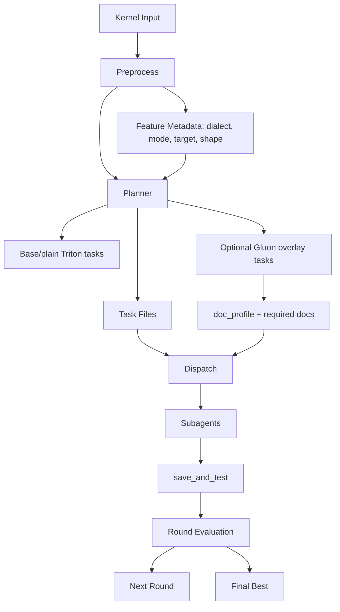
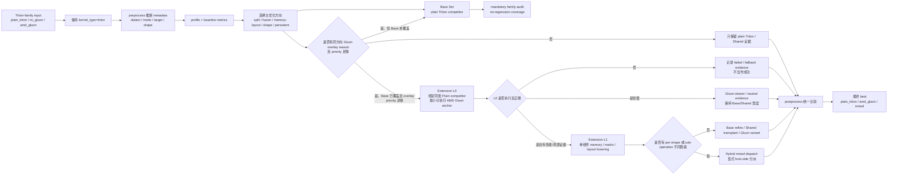

# Triton-Gluon Feature Design

本文档记录 feature 分支相对 `main` 的 Triton-Gluon 增量和当前真源分工。它只描述架构、流程和边界；具体 planner policy、worker contract、API recipe、failure triage 不在这里重复展开。

## 1. 定位

Gluon 是 Triton 路线中的 additional implementation feature，不是新的顶层 kernel 类型。

核心边界：

- 输入仍是 `kernel_type = triton`。
- `input_dialect` 只分类来源：`plain_triton`、`nv_gluon`、`amd_gluon`。
- 合法优化输出是 `plain_triton`、`amd_gluon`、`mixed`。
- 永远不产出优化态 `nv_gluon`。
- Base/plain Triton 竞品必须保留；Gluon 只在同一优化方向上作为 overlay 或 evidence。
- 最终 best 只看 verified correctness 和 FULL_BENCHMARK / per-shape no-regression，不因为使用 Gluon 加分。

## 2. 主要代码入口

- `src/minisweagent/run/preprocess/discovery_types.py`：Triton-family metadata、dialect、target、shape coverage。
- `src/minisweagent/run/preprocess/preprocessor.py`：preprocess、baseline、benchmark case stream。
- `src/minisweagent/agents/heterogeneous/task_generator.py`：planner prompt blocks、Base/Gluon task generation、task-generation audit。
- `src/minisweagent/agents/heterogeneous/prompts.py`：通用 task planner system prompt，Gluon 只保留最小硬边界。
- `src/minisweagent/run/gluon_doc_profiles.py`：`gluon_doc_profile` 到 required docs 的共享映射。
- `src/minisweagent/run/dispatch.py`：task metadata 归一化、doc gate 路径、worker config。
- `src/minisweagent/run/pipeline_helpers.py`：worker pipeline context、Gluon Working Set、required-doc block。
- `src/minisweagent/tools/save_and_test.py`：doc gate、required output dialect、target/scope static checks。
- `src/minisweagent/run/postprocess/benchmark_parsing.py`：dialect/API/layout/target contract classification。
- `src/minisweagent/run/postprocess/evaluation.py`：FULL_BENCHMARK、shape regression、verified selection。
- `src/minisweagent/run/postprocess/results.py`：final result attribution。
- `src/minisweagent/run/target_contracts.py`：target/forbidden scope parsing。

## 3. 文档真源分工

Gluon 规则不再由 `prompts.py` 或本文档常驻展开，而是按职责分层：

| 文件 | 职责 |
| --- | --- |
| `skills/triton-gluon/SKILL.md` | 薄入口：何时使用、不可违背规则、阅读路由。 |
| `skills/triton-gluon/docs/00_always_read.md` | Worker hard contract：doc gate、output/fallback、pre-edit plan、自检。 |
| `skills/triton-gluon/docs/10_search_policies.md` | Planner/search policy 真源：方向优先、overlay routing、metadata/doc profile、round progression。 |
| `skills/triton-gluon/docs/20_component_traits.md` | Atomic component 改法：layout、memory、matrix、shape 等一组件 patch 规则。 |
| `skills/triton-gluon/docs/30_architecture_notes.md` | Target/runtime：gfx942/gfx950/gfx1250、JIT/AOT、版本敏感点。 |
| `skills/triton-gluon/docs/50_api_reference.md` | API、rewrite recipe、failure triage 的 canonical 位置。 |
| `skills/triton-gluon/docs/60_real_patterns.md` | Kernel family 写法、真实 operator、source-first、benchmark boundary。 |
| `skills/triton-gluon/docs/40_examples.md` | 少量示例，按需读。 |
| `skills/triton-gluon/docs/70_backup_details.md` | 主文档缺页时的兜底和缺页上报。 |

## 4. 当前端到端流程



### 4.1 Preprocess

Preprocess 负责把 Triton-family 输入归一化到同一组 feature metadata：

- `kernel_type`
- `input_dialect`
- `gluon_feature_mode`
- `allowed_output_dialects`
- `preferred_output_dialects`
- `output_dialect_search_policy`
- `target_backend`
- `benchmark_shape_count`
- `benchmark_test_cases`
- `shape_coverage_profile`

这些 metadata 是 planner、dispatch、worker、postprocess 的共享上下文，避免不同阶段对 dialect、target、shape 的理解漂移。

### 4.2 Planner

Planner 的主轴是 Triton 优化方向，不是 Gluon API。

流程：

1. 读取 profiling、baseline、discovery、codebase context、COMMANDMENT、prior results。
2. 推断 planning traits：dialect、layout、memory、matrix、runtime、shape。
3. 先生成 Base/plain Triton no-regression 方向。
4. 只有当同方向存在明确 Gluon 机制时，才追加 Gluon overlay。
5. 通过 `gluon_doc_profile` 和可推断 signals 给 worker 路由 docs。

`TASKGEN_SYSTEM_PROMPT` 只保留通用 kernel-body-first、输出 JSON、少量 Gluon 硬边界。具体 metadata schema、L0 scope、composition、doc gate 由 `10_search_policies.md` 和运行时 prompt blocks 承担。

### 4.3 Task Generation Audit

Audit 的目标是避免明显无效或浪费 GPU 的 task，不再要求 planner 填完所有 worker 诊断字段。

生成时 hard reject 只保留结构性问题：

- 缺 mandatory Base family。
- Extension 数量超过预算。
- L0 指向不存在或非 plain Triton 的 `Plain competitor`。
- `minimum_executable_unit=infeasible` 或 `l0_scope_classification=infeasible` 却要求 `amd_gluon`。
- 明确无效的 enum / execution boundary 组合。

以下内容改为 warning、推断、drop overlay 或后置检查：

- 缺 `task_signals`、`routed_doc_reasons`、`kernel_family_signal`、`failure_layers`。
- Base anchor 不够局部或 component 不完全匹配。
- L0 soft diagnostics。
- whole-kernel compile-risk 的辅助字段不完整。

这样 Base tasks 不会因为一个 Gluon overlay 填表失败而整批失败。

### 4.4 Dispatch 和 Worker

Dispatch 从 task frontmatter 和 task body 推断：

- `required_output_dialect`
- 是否启用 skill runtime
- 是否需要 Gluon worker docs
- `gluon_doc_gate_required_paths`
- required / forbidden target scope

Worker 收到的 Gluon context 分为两级：

- Kernel family 写法：来自 `60_real_patterns.md`，解决一类 kernel 如何起步、如何保持同 ABI、如何按 benchmark boundary 归因。
- Atomic component 改法：来自 `20_component_traits.md`，解决一个组件如何安全改，例如 index/mask、load/store、layout/broadcast、matrix operand、reduction accumulator、shape dispatch。

API 细节和 failure triage 只在需要时跳到 `50_api_reference.md`。

### 4.5 save_and_test / Postprocess

运行时 gate 保留严格：

- required docs 必须先 view。
- required AMD Gluon 不能用 import-only、helper-only、empty patch 或 pure Triton fallback 冒充成功。
- target symbol / component、forbidden scope、backup/temp 文件由工具检查。
- actual output dialect、Gluon API contract、layout construction contract 分开判断。
- final best 只选择 verified correctness 和 FULL_BENCHMARK 改进。

## 5. Base 与 Gluon 的关系

Base/plain Triton 是主线和 no-regression anchor。Gluon 可以有三种结果：

- `Gluon-positive`：最终 best 是 `amd_gluon` 或 `mixed`，并击败 safe Base anchor。
- `Gluon-informed`：最终 best 是 plain Triton，但使用了从 Gluon/Shared evidence 中发现的 portable component。
- `Gluon-neutral/slower`：Gluon 执行过但没有赢，只作为诊断和后续路由证据。

plain Triton 最终获胜是合法结果。

## 6. 精简后的设计原则

- `prompts.py` 只写主流程和硬边界，不复制 policy 表。
- `10_search_policies.md` 是 planner metadata 和 search policy 单一真源。
- `00_always_read.md` 是 worker hard contract 单一真源。
- `20_component_traits.md` 教 worker 改一个 atomic component。
- `60_real_patterns.md` 教 worker 写一类 kernel 和处理真实 benchmark 边界。
- `50_api_reference.md` 才放 API 表、recipe 和 failure triage。
- Task-generation audit 只挡结构性无效任务；能推断、降级或后置验证的，不阻塞整批任务。

## 7. 验证重点

精简后需要持续验证：

- `prompts.py` 可导入 / py_compile。
- task generation 能保留 mandatory Base tasks。
- Gluon overlay 不因缺少路由辅助字段频繁整批失败。
- dispatch 仍能按 `gluon_doc_profile` / `required_gluon_docs` 打开 doc gate。
- `save_and_test` 仍拒绝未 view docs、helper-only、pure Triton fallback、forbidden scope。
- postprocess 仍按 verified FULL_BENCHMARK 和 per-shape no-regression 选择 final best。
# Triton-Gluon Feature Design

本文档说明 `feature/triton-gluon-mi3xx-baseline` 从 `main` 分支点
`bb7f1a0a` 之后、直到当前 HEAD `8381f6b6` 引入并保留下来的
Triton-Gluon 改进，并把
`/apps/qiongzhu/GEAK_triton_gluon_baseline_planner_widen` 中的 planner、
tasks、subagents、rounds、postprocess 流水线串起来。

> 文件名沿用需求里的 `trition_gluon_feature_design_zh.md`；正文统一使用
> 正确项目术语 `Triton`。

## 1. 一句话定位

这条 feature 分支把 Gluon 做成 **Triton 路线中的可审计实现层 overlay**，
而不是新增 `kernel_type=gluon`。

核心原则：

- 输入仍走 `kernel_type = triton`。
- `input_dialect` 只用于分类：`plain_triton`、`nv_gluon`、`amd_gluon`。
- 合法优化输出是 `plain_triton`、`amd_gluon`、`mixed`。
- 永远不产出优化态 `nv_gluon`。
- Base Triton 竞品必须保留；Gluon 是同一优化方向上的额外候选，不是替代品。
- plain Triton 最终获胜是合法结果；Gluon 只在证据支持时成为 positive 或 informed。
- 每轮 carry-forward 和最终 best 都以 verified FULL_BENCHMARK 改进为准；slowdown 或 unverified patch 只保留为诊断证据。

## 2. 代码和文档真源

主要代码入口：

- `src/minisweagent/run/preprocess/discovery_types.py`
- `src/minisweagent/run/preprocess/preprocessor.py`
- `src/minisweagent/run/pipeline_helpers.py`
- `src/minisweagent/run/dispatch.py`
- `src/minisweagent/run/gluon_doc_profiles.py`
- `src/minisweagent/run/target_contracts.py`
- `src/minisweagent/run/postprocess/benchmark_parsing.py`
- `src/minisweagent/run/postprocess/evaluation.py`
- `src/minisweagent/run/postprocess/results.py`
- `src/minisweagent/agents/heterogeneous/task_generator.py`
- `src/minisweagent/agents/heterogeneous/prompts.py`
- `src/minisweagent/agents/heterogeneous/result_scanning.py`
- `src/minisweagent/agents/heterogeneous/tools.py`
- `src/minisweagent/models/amd_base.py`
- `src/minisweagent/tools/save_and_test.py`

主要文档入口：

- `skills/triton-gluon/SKILL.md`
- `skills/triton-gluon/docs/00_always_read.md`
- `skills/triton-gluon/docs/10_search_policies.md`
- `skills/triton-gluon/docs/20_component_traits.md`
- `skills/triton-gluon/docs/30_architecture_notes.md`
- `skills/triton-gluon/docs/40_examples.md`
- `skills/triton-gluon/docs/50_api_reference.md`
- `skills/triton-gluon/docs/60_real_patterns.md`
- `skills/triton-gluon/docs/70_backup_details.md`
- `knowledge-base/amd-knowledge-base/layer-3-libraries/compilers/triton-gluon-on-rocm.md`
- `examples/triton_gluon_inputs/*`

普通 Triton / Base task 当前没有像 Gluon split-doc 这样的显式知识注入体系：

- planner 主要依赖 `TASKGEN_SYSTEM_PROMPT`、profiling、discovery、baseline metrics、COMMANDMENT、codebase context 和 Base family / Search Space Allocation 约束来生成普通 Triton task；
- 普通 Triton/Base subagent 默认按 planner 写好的 `task_prompt`、COMMANDMENT、pipeline context 和源码自行阅读、编辑、测试、profile；
- 普通 Base task 不走 Gluon split-doc gate，也没有强制额外 view 的 Triton 专属 docs；
- `knowledge_base/optimization_strategies.py` 仍是历史/可选入口：如果运行环境或外部生成物提供该文件，planner 可以读取；当前仓库实际没有这个下划线路径。

当前仓库实际存在的是 `knowledge-base/` 目录；`knowledge_base/optimization_strategies.py`
是否存在取决于运行 workspace 或外部生成物。这个路径不一致不是 Gluon feature
新引入的问题，而是从 fork 点 main 就沿用的普通 Triton 可选知识入口约定。

## 3. 从分支点以来的改进清单

下面按功能归类列出主要改进，便于回查。

### 3.1 Skill、split-docs 和知识库

- 增加 `skills/triton-gluon/SKILL.md`，定义 Triton-Gluon 的使用时机、不可违背规则、pre-edit lookup plan、implementation plan、L0/L1/Hybrid 任务合同。
- 把原先长文规则拆成 `skills/triton-gluon/docs/*`，让 planner 和 worker 能按信号路由到稳定文件与 heading，而不是整篇通读或凭记忆猜 API。
- `00_always_read.md` 成为所有 Triton-Gluon 任务的入口，包含 product contract、split-doc index、task routing、pre-edit contract、fallback contract、多 shape contract 和 anti-patterns。
- `10_search_policies.md` 明确 Base/Shared/Extension 是审计元数据，不是任务创意；主轴必须是具体优化方向。
- `10_search_policies.md` 新增 `overlay_priority_routing`，要求 Gluon overlay 只在同方向 plain Triton competitor 存在、且有明确 layout/memory/matrix/shape 机制时生成。
- `20_component_traits.md` 把 layout、SliceLayout/broadcast、memory、MFMA/WMMA、shape coverage 等实现 trait 独立出来。
- `30_architecture_notes.md` 补齐 `gfx942`、`gfx950`、`gfx1250`、Triton 版本、JIT/AOT、operator-local support、target backend 解析规则。
- `50_api_reference.md` 补齐 Gluon import、`@gluon.jit`、host-created layout、common rewrite table、broadcast recipe、AOT、AMD/NVIDIA quick patterns、debug order。
- `60_real_patterns.md` 收敛真实 operator 模式、kernel-family 策略、benchmark boundary、source-first triggers 和 repo-local notes。
- split-docs 进一步把 `BlockedLayout`、`SliceLayout`、`DotOperandLayout` 的 layout 构造拆成策略化合同：generated overlay 默认 `host_preferred`，已有 production/source-proven Gluon 可用 `source_preserve` 或 `constexpr_in_kernel_allowed`；真正拒绝的是 runtime layout object、非 `constexpr` layout 或依赖不清的动态 layout 构造。
- docs 和 worker contract 明确“definition-only helper 无效”：只定义 `@gluon.jit` helper、import Gluon、或写少量 `gl.*` 标记但没有真实 launch/target wiring，不能算 AMD Gluon 成功。
- 最近几次提交把 planner 文档和 worker 文档职责拆开：planner 默认读 `00_always_read.md`、`10_search_policies.md` 和少量 trait/pattern 摘要来决定任务；具体 API、example、backup 只通过 worker 的 `gluon_doc_profile` / `required_gluon_docs` 路由，不再作为 planner 大段上下文。
- `50_api_reference.md`、`40_examples.md`、`70_backup_details.md` 被收敛为 worker-routed 文档：API 细节、示例、缺页兜底都必须由任务信号或 doc gate 触发，避免 subagent 凭记忆改 Gluon，也避免 planner 被实现 cookbook 淹没。
- `70_backup_details.md` 缩小为“最后路由/缺页上报”文件，防止 worker 在主文档缺细节时瞎猜。
- 新增 AMD Triton-Gluon ROCm knowledge-base 文档，并更新 knowledge-base index。
- 新增 `examples/triton_gluon_inputs/*`，覆盖 plain Triton、NV Gluon、AMD Gluon 等基础输入样例和测试。
- 旧的 `docs/triton_gluon.md` 长文备份已删除；agent-facing 真源改为 split-docs，本文档仅作为本地设计说明保留。

### 3.2 Feature metadata 和输入方言推断

- 去掉用户必须显式提供 `input_dialect` 的要求，改成内部自动推断 `plain_triton`、`nv_gluon`、`amd_gluon`，同时保留覆盖入口用于 debug/ablation。
- 增加统一 Gluon metadata：
  - `kernel_type`
  - `input_dialect`
  - `gluon_feature_mode`
  - `gluon_baseline_profile`
  - `allowed_output_dialects`
  - `preferred_output_dialects`
  - `output_dialect_search_policy`
  - `target_backend`
  - `benchmark_shape_count`
  - `benchmark_test_cases`
  - `shape_coverage_profile`
- Triton 默认进入 `gluon_feature_mode=auto`，允许 `[plain_triton, amd_gluon]`，优先尝试结构上可行的 AMD Gluon，但保留 plain Triton 竞品。
- 支持 `gluon_feature_mode=off | auto | force`：`off` 用于 no-Gluon ablation，`force` 用于 AMD-Gluon-only debug/ablation。
- `target_backend` 解析顺序固定为：显式参数或 metadata -> `GEAK_TARGET_BACKEND` -> `rocminfo` -> 默认 `hip/gfx942`。
- 在 preprocess、orchestrator、task file、dispatch、worker prompt 中传播同一份 feature metadata，避免 planner 和 subagent 对 dialect/target/shape 的理解不一致。

### 3.3 Planner traits 和任务生成

- 新增 Gluon planning traits：语义、dialect、layout、memory、matrix、execution、version、operator support、shape coverage、shape dispatch 等。
- planner 不再生成泛泛的“rewrite to Gluon”任务；每个 Gluon 任务必须绑定一个具体 Triton 优化方向。
- 加入 Base/Shared/Extension 三类兼容元数据：
  - Base：plain Triton no-regression 竞品。
  - Shared：同方向 paired comparison 或 portable component transplant。
  - Extension：AMD Gluon L0/L1/Hybrid overlay。
- 规划主轴从 `search_set` 改为“优化方向 -> 实现层”；`required_output_dialect`、`Implementation layer`、`Extension layer` 是输出合同真源，`search_set` 只保留给审计、调度、归因和旧路径兼容。
- 增加 Search Space Allocation block，要求 planner 先保留 Base Triton no-regression 覆盖，再添加 Gluon overlay。
- 增加 Base Triton mandatory families：
  - `base_swizzle_and_tile_schedule`
  - `base_split_k_or_multipass_reduce`
  - `base_scaled_dot_fusion`
  - `base_hot_path_streamline`
  - `base_small_matrix_persistent_or_launch_amortization`
- 对矩阵、scaled dot、latency-bound、小矩阵、多 shape/bucketed 场景，mandatory Base family 变成结构性覆盖要求，不只是任务数量建议。
- planner prompt 要求每个 Base 任务写 `Base family: <family_id>`，Shared 写 `Shared source family: <family_id>`，Extension 写 `Extension layer: L0 | L1 | Hybrid`。
- Extension 任务还必须写优化方向、Source Base family、Plain competitor、overlay reason、priority、implementation layer、performance hypothesis、measurement boundary、comparison target、allowed change 和 reject 条件。
- stage/helper/local-expression scoped overlay 任务必须写 `Target symbol:` 或 `Target component:`；如果 `Allowed change` 中有局部变量、表达式、load/store、tensor/path，需用反引号或 `components(...)` / `expressions(...)` 形式暴露给 dispatch 和 selector，作为 `required_patch_target_symbols`。
- `src/minisweagent/run/target_contracts.py` 抽出共享 target-scope 解析：支持反引号局部名、`components(...)` / `expressions(...)` / `loads(...)` / `stores(...)` 组，以及 `stage1 inner loop` 这类 stage-scoped 描述；同时解析 forbidden scope，例如 whole-kernel rewrite、helper-only、dot loop、MFMA path、buffer ops、bias load。
- 新增 `source_origin`、`gluon_tl_policy`、`layout_construction_policy` 三类合同，把输出 dialect、Gluon 内部 API 合法性、layout 构造策略拆开：合法 `tl.range` / `tl.constexpr` 或 source-preserved `tl.where` 不会让 executed AMD Gluon path 误判为 `mixed`。
- Round 1 L0 overlay 必须绑定同批次的 `Plain competitor`，且该 plain 任务的 `Base family` 必须匹配 overlay 的 `Source Base family`；只写 family 名称但没有具体同批任务不再通过审计。
- Round 1 L0 overlay 进一步要求和 `Plain competitor` 绑定到同一 target component / optimization direction，而不只是同一个 Source Base family；`Plain competitor` 必须是同批 `required_output_dialect=plain_triton` 的 Base task，不能是 Shared、Gluon、mixed 或 hybrid task。
- 新增结构化 `Gluon L0 scope classification`：planner 在发 L0 前必须写 `l0_scope_classification: low_coupling | high_coupling | infeasible` 和 `l0_coupling_reasons`，判断最小可执行单元、layout-heavy 风险、是否能不翻译整个算法就执行并反馈到 measured output、预期是 `execution_anchor` 还是 `performance_candidate`。
- L0 审计会拦截不自洽的高耦合 target：`inline_scoped_helper` 不能用于 online softmax accumulator、`tl.dot`/matrix path、loop-carried reduction、cross-stage ABI、wrapper reroute 或 whole-kernel/helper rewrite；此类任务必须 shrink、report infeasible、改用有理由的 `whole_jit_kernel`，或不发 Gluon task。
- L0 execution-boundary metadata 成为 Round 1 AMD Gluon overlay 的硬合同：`minimum_executable_unit`、`allowed_execution_path`、`scope_infeasible_policy` 必须清楚；如果 scoped path 不可行，不能发一个 required AMD Gluon task 去强迫 worker 扩大到整 kernel。
- `whole_jit_kernel` 被明确为 compile-risk anchor，而不是默认 L0 形态；若使用，task 必须写 `expected_failure_layers`、`first_patch_compile_goal`、`do_not_optimize_before_compile: true`、`matrix_lowering_required: true|false`，让 `patch_0` 先证明 launcher/layout/ABI/最小执行 wiring。
- 每个 Gluon task 现在还要暴露 planner docs routing metadata：`task_signals`、`routed_doc_reasons`、`kernel_family_signal`、`failure_layers`，把 `00/10/20/30/50/60` 的路由信号转成 planner 字段和 worker doc gate 依据，而不是只在正文泛泛说“读文档”。
- 新增 `overlay_direction_vs_mechanism` 规则：`Optimization direction` 必须是 plain/Gluon 共享的性能目标，explicit layout、`DotOperandLayout`、buffer ops、`@gluon.jit` 等只能作为 `Gluon overlay reason` / `Performance hypothesis` / `Allowed change`，不能单独变成优化方向。
- 新增 `atomic_component_lattice` 和 first-pass L0 scope decision：planner 先把目标拆成 atomic components（index/mask/load-store/layout/matrix/scale/reduction/state/shape/wrapper 等），为 `patch_0` 选择一个 primary component；无法判断时默认 Branch A 局部 smoke/probe，而不是默认 whole-kernel。
- First-pass L0 只有两个合法分支：Branch A 是 local single-component smoke/probe（`inline_scoped_helper`，只改一个 primary atomic component）；Branch B 是 whole-helper layout skeleton（`whole_jit_kernel`，必须把 target retarget 成 whole helper/stage，并写 compile-risk 字段）。`local target + whole_jit_kernel` 是不自洽任务。
- required Gluon / gluon-only 场景会把部分 soft diagnostics 升级为 repair-before-dispatch：例如 local target promoted to whole kernel、matrix metadata inconsistent、component bundle too broad、unknown family whole kernel。
- Round 2/3 仍要继承或引用 L0 scope classification：prior Gluon compile failed、未执行或 scope escalation 时不能升级 L1 / `gluon_variant` / Hybrid；正确但慢只能做 narrow overhead refinement；只有 shape/sub-operation win 才能进入 variant/hybrid。
- L1 和 Hybrid 不凭兴趣升级，只由 prior verified evidence、anchor viability、per-shape/sub-operation 证据触发。

### 3.4 GPU budget、队列和多轮搜索

- 单 GPU 时使用 serial interleave：先生成 mandatory plain Triton 方向，再按证据决定是否追加同方向 AMD Gluon L0，GPU pool 串行执行。
- 多 GPU 时使用 direction-first mixed portfolio：Base slots 至少覆盖 `max(num_gpus, mandatory_family_count)`，Shared/Extension 只是同方向实现层 overlay，可以超过 GPU 数并由队列消化。
- planner prompt 明确区分“可用 GPU 数”和“应该规划的任务总数”；Search Space Allocation 推荐任务数可以大于 GPU 数。
- 初轮 Extension 封顶：非已有 AMD Gluon 输入时，round 1 最多一个 Extension L0；只有 `overlay_priority_routing` 为 Prefer 或高置信 Consider 时才生成，否则把预算继续用于 plain Triton 方向。
- round 2 开始使用 safe anchor 和 prior evidence 生成 Base refine、Shared transplant、Gluon variant 或 L1 lowering。
- round 3 收敛到 safe anchor，只在证据支持时添加 Hybrid/mixed dispatch。
- `_previous_gluon_signal` 从上轮结果中区分 `won`、`attempted`、`slower`、`failed`，并且过滤掉 plain Triton Base win，避免误扩 Gluon budget。

### 3.5 Shape coverage 和 benchmark case stream

- 增加 `derive_shape_coverage_profile`，分类为 `unknown`、`single`、`multi`、`bucketed`。
- 多 shape 下 correctness 和 performance 使用同一个有序 case stream；每个 shape 都必须正确。
- planner 注入 Shape Coverage Policy，要求 task 自分类为 `single_shape_viability`、`shape_robust` 或 `shape_bucketed`。
- 多 shape 场景至少保留一个 `shape_robust` Base 竞品。
- bucketed 场景偏向显式 host-side dispatch，禁止把分桶隐藏在 `@triton.heuristics` 中。
- shape/layout 相关 constexpr 风险被显式标注：布局若依赖 shape、block、num_warps 或 target family，应在 host 侧构造后作为 `constexpr` 传入。
- postprocess 记录 `per_shape_speedups` 和 `has_significant_shape_regression`，下一轮 planner 会看到回归 shape 并生成修复任务。

### 3.6 Worker/subagent 上下文和文档 gate

- `pipeline_helpers.py` 向 worker 注入 `Gluon Feature Context`、`Gluon Working Set`、`Shape Coverage Working Set`。
- 必选 AMD Gluon 任务会内联关键 skill context，确保 subagent 知道 `required_output_dialect=amd_gluon` 不是可选建议。
- planner 生成 task frontmatter：
  - `search_set`
  - `required_output_dialect`
  - `gluon_doc_profile`
  - `required_gluon_docs`
  - `source_base_family`
  - `plain_competitor`
  - `implementation_layer`
  - `extension_layer`
  - `required_patch_target_symbols`
  - `forbidden_patch_target_symbols`
  - `source_origin`
  - `gluon_tl_policy`
  - `allowed_tl_symbols`
  - `forbidden_tl_symbols`
  - `layout_construction_policy`
  - `execution_mode`
  - `target_stage`
  - `target_kernel_role`
  - `measured_output_dependency`
  - `integration_boundary`
  - `l0_scope_classification`
  - `l0_coupling_reasons`
  - `expected_failure_layers`
  - `first_patch_compile_goal`
  - `do_not_optimize_before_compile`
  - `matrix_lowering_required`
  - `declared_failure_layer`
  - `changed_failure_layer`
  - `task_signals`
  - `routed_doc_reasons`
  - `kernel_family_signal`
  - `failure_layers`
  - `extension_intent`
  - `expected_outcome`
  - `not_viable_for_l1_if_slower_than_base`
  - `overhead_source_to_record`
  - `minimum_executable_unit`
  - `allowed_execution_path`
  - `scope_infeasible_policy`
  - `whole_kernel_required_reason`
  - `target_symbol`
  - `target_component`
- `gluon_doc_profile` 支持稳定档案：`extension_l0_minimal`、`nv_to_amd_translation`、`memory_lowering`、`matrix_lowering`、`shape_bucketed_dispatch`、`jit_aot_sensitive`、`shared_transplant`、`gluon_variant_from_anchor`、`hybrid_dispatch`、`hybrid_dispatch_from_evidence`。
- `src/minisweagent/run/gluon_doc_profiles.py` 成为 doc profile 的共享真源：定义 mandatory docs、每个 profile 的 required docs，以及“哪些 task 需要 worker-side Gluon docs/context”的判定。
- dispatch 会把 mandatory docs、`gluon_doc_profile` docs、显式 `required_gluon_docs` 和旧任务启发式 docs 做加法合并，转成 `gluon_doc_gate_required_paths`；显式 docs 只能补充，不能替换 mandatory/profile 文档。
- `save_and_test` 增加 Gluon 文档 gate：未 view 完 required docs 时拒绝保存/测试 Gluon 任务。
- 对旧任务或手写任务，dispatch 仍可通过关键词启发式推断需要哪些 Gluon split-docs；但 `search_set` 或 run-level Gluon metadata 不再单独触发 worker Gluon doc gate，避免 Base/plain Triton 任务被误当成 Gluon implementation。
- dispatch 现在同时推断 required 和 forbidden target scope，并把 execution-boundary 字段注入 worker context；plain/Base 任务只有在真正需要 worker-side Gluon docs 时才携带 `gluon_doc_profile` / `required_gluon_docs`，降低普通 Triton task 噪声。
- 必选 AMD Gluon 任务不能用纯 Triton fallback 当成功；fallback 只能是一个真实 Gluon patch 失败后的证据。

### 3.7 Dispatch、subagents 和调度阶段

- task file 到 `AgentTask` 的转换合并 preprocess metadata 和 task frontmatter，保证 subagent 收到同一份 feature contract。
- dispatch stage 按 `required_output_dialect` 与 layer metadata 识别必选 AMD Gluon overlay，`search_set` 仅作为兼容元数据；`extension + amd_gluon` 任务进入更高优先级阶段。
- 即使高优任务已有 speedup，也会继续执行必要 Extension Gluon 任务，避免 staged dispatch 提前停掉 mandatory Gluon evidence。
- `ParallelAgent` 继续按 GPU pool 并发执行，但任务数可以大于 GPU 数；溢出任务排队。
- subagent 仍以 `strategy_agent` 为执行单位，读取代码、编辑、`save_and_test`、profile、submit。
- COMMANDMENT 保持唯一测试契约，worker 不允许改 harness、环境或 benchmark contract。

### 3.8 Patch selection、evaluation 和 result attribution

- `result_scanning.py` 扫描 `best_results.json` 时带出 `required_output_dialect`、`actual_output_dialect`、`dialect_contract_satisfied`、`gluon_execution_contract_satisfied`、`per_shape_speedups`、`has_significant_shape_regression`。
- `result_scanning.py` 还会带出 `scope_compliant`、`forbidden_scope_violation`、`scope_escalation_violation`、`l0_scope_classification`、`l0_coupling_reasons`、`minimum_executable_unit`、`allowed_execution_path`、`scope_infeasible_policy`、`scope_infeasible_reported`、`extension_intent`、`expected_outcome`、`overhead_source` 和 `gluon_l1_anchor_viability`，用于下一轮判断 L0 是否只是执行锚点、是否可升级到 L1。
- postprocess 会继承 task metadata 并检测 L0 scope escalation：当 task 声明 `inline_scoped_helper`，但 patch 新增 whole-kernel `@gluon.jit`、新建同名 full Gluon kernel、或把 wrapper 主路径 reroute 到 whole Gluon kernel 时，标记 `scope_compliant=false` / `scope_escalation_violation`，并作为不可选 Gluon evidence。
- result metadata 还会归纳 `gluon_evidence_summary`：`compile_failed_or_not_executed`、`scope_escalation`、`executed_slower`、`executed_win`、`executed_win_by_shape`，供下一轮 planner 决定 shrink/retry L0、做 overhead refinement、还是允许 variant/hybrid。
- selector 现在把 `actual_output_dialect` 与 `gluon_api_contract_status` 分开：前者按执行路径和 host dispatch 判断，后者检查 `@gluon.jit` 内部 `tl.*` 是否符合 `gluon_tl_policy`；过渡期保留 `legacy_output_dialect_classification` 便于审计差异。
- required Gluon patch contract 继续收紧：helper-only / not-executed 失败会把下一 patch 限定为 wiring-only；patch 不得删除或重命名 harness/import 依赖的 public wrapper；MFMA result layout 的 `elem_type` 不能把输入 fp16/bf16 当成 accumulator/result layout 类型。
- atomic / descriptor / async / scheduler / work-stealing 等高级 Gluon 方向被标记为后置特性：只有简单 L0/anchor 正确或 production source 明确支持后才能规划，不能作为 first-pass 默认路径。
- postprocess 使用 deterministic best patch selection，强制以真实 baseline 和 task contract 选 patch。
- 最终结果以 FULL_BENCHMARK verified speedup 为权威。
- empty patch、dialect contract 不满足、required target symbol 未触达、helper-only Gluon patch 都会被 invalidated 或跳过。
- patch 若触达 forbidden target scope（例如任务禁止 whole-kernel rewrite 却新增 whole `@gluon.jit` rewrite，或禁止 dot/MFMA/buffer/bias path 却实际改到这些路径），会在 `save_and_test` 和 selector 中被拒绝，worker 应缩小或拆分任务，而不是靠扩大 scope 修复。
- required AMD Gluon patch 还会执行 task-aware 静态拦截：拒绝 broad `try/except Exception` 掩盖 Gluon 失败后走 plain Triton launcher，拒绝 matrix lowering 任务里机械地用 generic `gl.dot` 当成 MFMA/operand-layout 实现，拒绝编辑备份/临时文件。
- `classify_patch_output_dialect` 识别 `plain_triton`、`amd_gluon`、`mixed`，并与 `required_output_dialect` 对齐。
- 每轮结束后 `post_round_evaluate` 在独立 worktree 应用 best patch，重新跑 correctness、FULL_BENCHMARK/profile，写 `round_N_evaluation.json`。
- `post_round_evaluate` 只有在 `verified_speedup > 1.0` 且无显著 shape regression 时才更新 `ctx["starting_patch"]` / `_best_global_speedup`；slowdown 只保留为诊断。
- task generation audit 失败时，如果传入 round task 输出目录或设置 `GEAK_TASKGEN_AUDIT_DUMP_DIR`，会写出 `task_generation_audit_failed_*.json`，包含 raw submitted JSON、parsed task summaries、mandatory Base families、expected Extension slots 和错误原因，方便复盘 planner 为什么被审计拒绝。

### 3.9 最新保留 feature matrix

这张矩阵按“整体流程层”分类，而不是按单个 commit 罗列。它只列当前分支仍保留下来的 feature。

#### 3.9.1 流程总览

| 流程层 | 设计目标 | 保留 feature | 主要模块 |
| --- | --- | --- | --- |
| Preprocess / feature metadata | 让 Triton-family 输入在进入 planner 前带上同一套 dialect、target、shape 信息 | dialect 自动推断、Gluon mode、target backend 解析、shape coverage profile、benchmark case stream | `preprocess/discovery_types.py`、`preprocess/preprocessor.py` |
| Orchestrator / Planner | 先规划 Triton 优化方向，再决定 plain / Gluon / mixed 实现层 | Base mandatory families、overlay priority routing、same-batch/same-target plain competitor、结构化 L0 scope classification、docs routing metadata、compile-risk anchor、audit failure dump | `agents/heterogeneous/task_generator.py`、`agents/heterogeneous/prompts.py` |
| Dispatch / Worker context | 把 task 合同变成 subagent 可执行、可 gate 的上下文 | `required_output_dialect` 推断、doc profile -> gate path、显式/推断 doc gate 合并、worker doc gate 与 planner guidance 分离、required/forbidden target scope | `run/dispatch.py`、`run/gluon_doc_profiles.py`、`run/target_contracts.py`、`run/pipeline_helpers.py` |
| Subagent implementation guardrails | 限制 worker 只做有证据的 scoped Gluon patch | targeted split-doc reading、lookup/implementation plan、one component per patch、source-first guardrails、same ABI comparison | `skills/triton-gluon/docs/*`、`pipeline_helpers.py` |
| Patch contract / deterministic selection | 防止 marker-only、helper-only、fallback、无关 target 或越界 scope patch 被选中 | dialect contract、target-symbol/target-component touch、forbidden-scope rejection、target-related Gluon execution、static preflight rejection、safe anchor selection | `tools/save_and_test.py`、`run/target_contracts.py`、`postprocess/benchmark_parsing.py` |
| Round evaluation / final selection | 只让 verified improvement 推动下一轮和最终 best | FULL_BENCHMARK verified speedup、shape regression gate、scope escalation evidence、L0 anchor viability、slowdown diagnostic、final verified selection | `postprocess/evaluation.py`、`postprocess/results.py`、`result_scanning.py` |

#### 3.9.2 Preprocess / feature metadata

| Feature | 作用模块 | 用途 |
| --- | --- | --- |
| `input_dialect` 自动推断 | `preprocess/discovery_types.py`、`preprocessor.py` | 识别 `plain_triton`、`nv_gluon`、`amd_gluon`，减少用户必须手写 metadata 的需求。 |
| `gluon_feature_mode=off/auto/force` | preprocess、orchestrator | 支持 no-Gluon ablation、默认自动拓宽、AMD-Gluon-only debug。 |
| `target_backend` 解析 | preprocess、planner metadata | 从显式配置、环境、`rocminfo` 或默认值确定 AMD target，让 arch/JIT/AOT guidance 有一致输入。 |
| shape coverage profile | preprocess、planner、postprocess | 把 benchmark case stream 分类为 single/multi/bucketed，为 Base coverage、Gluon constexpr 风险和 per-shape regression gate 提供依据。 |
| `allowed/preferred_output_dialects` | preprocess、task metadata | 让 planner 知道可以搜索 `plain_triton`、`amd_gluon`、`mixed`，但不产出 optimized `nv_gluon`。 |

#### 3.9.3 Orchestrator / Planner

| Feature | 作用模块 | 用途 |
| --- | --- | --- |
| Direction-first search allocation | `task_generator.py`、`prompts.py` | 规划主轴是优化方向，不是 `Base/Shared/Extension` 标签；Gluon 只作为同方向实现层 overlay。 |
| Base mandatory families | `task_generator.py` | 保住 main-like Triton no-regression 搜索空间，避免 Gluon 拓宽后丢掉最可能赢的 plain Triton 改写。 |
| Overlay priority routing | `10_search_policies.md`、`task_generator.py` | 只在同方向 plain competitor 存在且有 layout/memory/matrix/shape 机制时生成 L0 overlay。 |
| Same-batch plain competitor binding | `task_generator.py` | Round 1 L0 必须绑定具体同批 Base 任务和 Source Base family，防止泛泛“rewrite to Gluon”。 |
| Same-component overlay binding | `task_generator.py`、`target_contracts.py` | L0 overlay 还必须和 plain competitor 绑定到完全相同的 `Optimization direction` 和同一 target component；没有 scoped `Target component` / `Allowed change` 的 broad Base task 不能当 L0 plain competitor。 |
| Structured L0 scope classification | `10_search_policies.md`、`task_generator.py` | 发 L0 或后续基于 L0 evidence 的任务前，必须写 `l0_scope_classification` / `l0_coupling_reasons`，判断 low/high coupling、infeasible、最小可执行单元和升级门禁。 |
| Atomic component lattice | `10_search_policies.md`、`task_generator.py` | planner 先把候选目标拆成 index/mask/load-store/layout/matrix/scale/reduction/state/shape/wrapper 等 atomic components，`patch_0` 只选一个 primary component。 |
| First-pass L0 Branch A/B | `10_search_policies.md`、`task_generator.py` | L0 首次生成必须二选一：Branch A local smoke/probe 或 Branch B whole-helper skeleton；unknown 默认 Branch A，禁止 local target 直接声明 `whole_jit_kernel`。 |
| L0 execution-boundary metadata | `task_generator.py`、`prompts.py` | Round 1 L0 必须写 `minimum_executable_unit`、`allowed_execution_path`、`scope_infeasible_policy`，不可行时不发 required AMD Gluon task。 |
| High-coupling L0 audit | `task_generator.py` | `inline_scoped_helper` 不得用于 online softmax accumulator、dot/matrix path、loop-carried reduction、cross-stage ABI、wrapper reroute 或 whole-kernel rewrite；审计失败会给 shrink/repair hint。 |
| Overlay direction vs mechanism | `10_search_policies.md`、`task_generator.py` | `Optimization direction` 必须是共享性能目标；Gluon-specific 的 explicit layout、buffer、DotOperandLayout、`@gluon.jit` 只能放在 overlay reason / implementation layer / performance hypothesis。 |
| Planner docs routing metadata | `task_generator.py`、`prompts.py` | Gluon task 要写 `task_signals`、`routed_doc_reasons`、`kernel_family_signal`、`failure_layers`，把 docs 信号映射到 required docs 和 worker failure-layer 路由。 |
| Compile-risk whole-kernel anchor | `task_generator.py`、`10_search_policies.md` | `whole_jit_kernel` 任务必须写 `expected_failure_layers`、`first_patch_compile_goal`、`do_not_optimize_before_compile`、`matrix_lowering_required`，`patch_0` 只证明 compile/execute anchor。 |
| Required Gluon diagnostic gate | `task_generator.py` | required Gluon / gluon-only task 若出现 high-risk soft diagnostics，会先 repair/shrink 或报告 infeasible，再进入 dispatch；mixed portfolio 可保留 warning + repair hint。 |
| Planner/worker doc 分层 | `prompts.py`、`task_generator.py`、`skills/triton-gluon/docs/*` | planner 读取搜索策略和必要 traits；API cookbook、examples、backup 由 worker doc profile 路由，减少 planning prompt 噪声。 |
| `gluon_doc_profile` / `required_gluon_docs` | `task_generator.py`、`gluon_doc_profiles.py` | 让任务把“为什么需要哪些 Gluon 文档”结构化传给 dispatch 和 `save_and_test`。 |
| `source_origin` 路由 | `task_generator.py`、`dispatch.py` | 区分 generated overlay、existing AMD Gluon production operator、NV Gluon translation；缺失时 fail-closed 到 generated overlay 严格合同。 |
| Scoped target component metadata | `prompts.py`、`task_generator.py` | stage/helper/local-expression 任务必须暴露 `Target symbol` / `Target component` 和 backticked local names，供后续合同检查。 |
| Plain task metadata 降噪 | `task_generator.py`、`dispatch.py` | plain/Base 任务不再因为兼容 profile 或 run-level Gluon metadata 携带 worker-only doc gate / L0 execution 字段。 |
| Task-generation audit dump | `task_generator.py`、`tools.py` | 审计失败时写出 raw tasks、parsed summaries 和错误原因，便于定位 planner 丢字段、错 competitor 或越界生成。 |
| Evidence-anchored composition tags | `10_search_policies.md`、`task_generator.py` | 后续轮用 `Safe anchor`、`Source component`、`Composition type` 限制 Shared transplant、Gluon variant、Hybrid dispatch。 |

#### 3.9.4 Dispatch / Worker context

| Feature | 作用模块 | 用途 |
| --- | --- | --- |
| `required_output_dialect` 归一化 | `dispatch.py` | 从 metadata、task body、implementation layer、extension layer 推断 worker 必须产出的 dialect。 |
| `required_patch_target_symbols` 推断 | `dispatch.py`、`target_contracts.py` | 合并显式 metadata、`Target symbol`、`Target component`、`Allowed change` 中的反引号/local groups，以及 `stage1 inner loop` 这类 stage-scoped 描述，传给 `save_and_test`。 |
| `forbidden_patch_target_symbols` 推断 | `dispatch.py`、`target_contracts.py` | 从 `Forbidden change`、`Reject if`、`Do NOT ...` 解析 whole-kernel、helper-only、dot/MFMA、buffer/bias 等 forbidden scope，防止 worker 靠扩大 scope 过关。 |
| Shared doc profile registry | `run/gluon_doc_profiles.py` | 统一 planner、dispatch、worker 对 `gluon_doc_profile` 的含义，避免多处硬编码不一致。 |
| Doc gate additive merge | `dispatch.py` | mandatory docs + profile docs + 显式 docs + heuristic docs 加法合并；显式 docs 不覆盖 mandatory/profile docs。 |
| Worker doc gate 与 planner guidance 分离 | `gluon_doc_profiles.py`、`pipeline_helpers.py` | run-level Gluon metadata 或 `search_set` 不再单独让 Base/plain task 进入 worker Gluon doc gate。 |
| L0 execution-boundary context | `dispatch.py`、`pipeline_helpers.py` | 把 `extension_intent`、`minimum_executable_unit`、`allowed_execution_path`、`scope_infeasible_policy`、`whole_kernel_required_reason` 注入 worker prompt。 |
| Inline scoped helper boundary | `pipeline_helpers.py` | 当 `allowed_execution_path=inline_scoped_helper` 时，worker 明确不能新增 whole-kernel `@gluon.jit`、不能 reroute wrapper 主路径到 full Gluon kernel、不能通过扩大 scope 报成功。 |
| Gluon API / layout policy context | `dispatch.py`、`pipeline_helpers.py` | 把 `gluon_tl_policy`、`allowed/forbidden_tl_symbols`、`layout_construction_policy` 注入 worker，避免误把合法 production `tl.*` 视为 mixed，也避免新生成 path 混入 leftover `tl.*`。 |
| Patch Evolution Working Set | `pipeline_helpers.py`、`60_real_patterns.md` | 所有进入 Gluon worker docs/context 的任务都获得 pass/fail 双轨 patch evolution、task consistency check、failure-to-next-patch map；Base/plain task 不强制进入该状态机。 |
| REQUIRED BEFORE EDITING block | `pipeline_helpers.py` | subagent prompt 明确列出必须 `view` 的绝对 split-doc path；`save_and_test` 可据此强制 gate。 |
| Compact Gluon Working Set | `pipeline_helpers.py` | 把 worker 必须遵守的 lookup plan、implementation plan、same ABI、single-component scope、failure modes 注入任务上下文。 |

#### 3.9.5 Subagent implementation guardrails

| Feature | 作用模块 | 用途 |
| --- | --- | --- |
| Targeted split-doc reading | `00_always_read.md`、`pipeline_helpers.py` | worker 先读入口和 task routing，再跳到精确 heading；缺细节时读 `70_backup_details.md` 并报告缺页。 |
| Pre-edit lookup plan | `00_always_read.md`、`pipeline_helpers.py` | 要求记录 task signals、docs/headings、viewed 状态、source sections，避免未读文档就写 Gluon。 |
| Pre-edit implementation plan | `00_always_read.md`、`pipeline_helpers.py` | 要求写 scoped subpath、same ABI、freeze contract、layout/matrix/buffer path、module wiring、target symbol/component。 |
| L0 patch evolution | `00_always_read.md`、`pipeline_helpers.py`、`60_real_patterns.md` | `patch_0` 先证明最小 correctness anchor，后续 patch 每次只改一个 layout、launch constant、memory path、matrix subpath 或 dispatch condition。 |
| Failure-layer routing | `60_real_patterns.md`、`pipeline_helpers.py` | 失败后下一 patch 只修当前 failure layer：broadcast/layout、matrix/dot、layout verifier/arch、dtype/load/store、reduction/accumulator、helper wiring、scope/forbidden path。 |
| Task consistency soft correction | `60_real_patterns.md`、`pipeline_helpers.py` | worker 编辑前对照 task、metadata、source、routed docs；若 failure layer 或 doc routing 不完整，写 `Task correction` 继续在原 task 边界内修正，不新增 selector 字段。 |
| Public API freeze | `00_always_read.md`、`50_api_reference.md`、`save_and_test.py` | worker 不得删除/重命名 harness 或 module import 依赖的 exported wrapper；需要 host dispatch 时保持 public function 和 signature。 |
| Execution anchor attribution | `00_always_read.md`、`60_real_patterns.md`、`result_scanning.py` | `extension_intent=execution_anchor` 时，正确但慢的 L0 是 overhead/layout 证据，不自动升级 L1/MFMA/Hybrid。 |
| Scoped infeasibility handling | `pipeline_helpers.py`、`10_search_policies.md` | 如果 scoped Gluon 不能在允许路径内实现，worker 应 shrink/report infeasible 或拆任务，不能私自改 whole kernel。 |
| Layout construction policy | `20_component_traits.md`、`50_api_reference.md`、`benchmark_parsing.py` | generated overlay 默认 host-side layout factory；source-proven / production Gluon 可保留 in-kernel `gl.constexpr` layout；runtime layout object 或依赖不清的动态 layout 构造会被拒绝。 |
| One component per patch | `10_search_policies.md`、`60_real_patterns.md` | 除非 `bundle_allowed=true`，每个 patch 只改变一个 subpath/component，方便 round 2 归因。 |
| Source-first triggers | `60_real_patterns.md` | 遇到真实 aiter/descriptor/nested layout/JIT-AOT 包装时先读 operator-local source，不做泛化改写。 |

#### 3.9.6 Patch contract / deterministic selection

| Feature | 作用模块 | 用途 |
| --- | --- | --- |
| Dialect contract | `save_and_test.py`、`postprocess/benchmark_parsing.py` | `required_output_dialect=amd_gluon/mixed` 必须和实际 patch dialect 对齐，防止 plain fallback 冒充成功。 |
| Gluon API contract | `save_and_test.py`、`postprocess/benchmark_parsing.py` | `actual_output_dialect` 按执行路径判定；`gluon_api_contract_status` 单独判断 `tl.*` 是否为 allowed/preserved 或 leftover device API。 |
| Target symbol / component touch | `dispatch.py`、`target_contracts.py`、`benchmark_parsing.py` | 只认可新增代码直接引用 target 或在 target 函数体内新增代码；diff context、删除行、注释不算触达。 |
| Forbidden scope rejection | `target_contracts.py`、`save_and_test.py`、`benchmark_parsing.py` | 如果任务禁止 whole-kernel/helper-only/dot/MFMA/buffer/bias 等 scope，patch 触达这些路径会被拒绝。 |
| Target-related Gluon execution | `benchmark_parsing.py` | helper 命名、alias、target body launch、target-related dispatch 必须能把 Gluon 执行路径和 required symbols 绑定。 |
| Marker-only / definition-only rejection | `save_and_test.py`、`benchmark_parsing.py` | 只加 import、`@gluon.jit`、`gl.*` marker 或未执行 helper 的 patch 会被拒绝。 |
| Task-aware static preflight | `benchmark_parsing.py`、`save_and_test.py` | required AMD Gluon task 拒绝 broad exception fallback、matrix lowering 中机械 generic `gl.dot`、备份/临时文件。 |
| Scope compliance reporting | `benchmark_parsing.py`、`result_scanning.py` | `best_results.json` / prior round scan 中记录 `scope_compliant`、`forbidden_scope_violation`、execution-boundary 和 infeasible 状态。 |
| Scope escalation detection | `benchmark_parsing.py` | 对 inline-scoped L0，检测新增 whole-kernel Gluon helper、同名 full `_gluon` kernel、wrapper 主路径 reroute 等 scope escalation，并把该 patch 作为 invalid/diagnostic evidence。 |
| Required patch hardening | `save_and_test.py`、`benchmark_parsing.py` | helper-only 后下一 patch 只允许 wiring/output-feeding；public API 删除/重命名、MFMA result layout elem_type 错误等会归入 contract/failure-layer 指导。 |
| `safe_anchor` comparison | `benchmark_parsing.py`、`evaluation.py` | later-round composition 与 verified safe anchor 对齐，不把慢 patch 或 shape regression 当作下一轮起点。 |
| Deterministic best patch selection | `benchmark_parsing.py` | 统一处理 empty patch、shape regression、dialect/target/execution contract、verified speedup，减少 subagent 自报偏差。 |

#### 3.9.7 Round evaluation / final selection

| Feature | 作用模块 | 用途 |
| --- | --- | --- |
| Post-round independent evaluation | `postprocess/evaluation.py`、`results.py` | 在独立 worktree 应用候选 patch，重新跑 correctness、FULL_BENCHMARK、profile。 |
| Verified carry-forward gate | `results.py` | 只有 `verified_speedup > 1.0` 且无显著 shape regression 才更新 `ctx["starting_patch"]` 和全局 best。 |
| L0 anchor viability | `result_scanning.py`、`task_generator.py` | 结合 dialect/execution、speedup、shape regression、`extension_intent` 和 `not_viable_for_l1_if_slower_than_base` 标注 `viable_for_l1`、`neutral_or_slow_anchor` 或 `not_viable_for_l1`。 |
| Gluon evidence summary | `benchmark_parsing.py`、`result_scanning.py`、`task_generator.py` | 把 prior Gluon 归纳为 compile failed/not executed、scope escalation、executed slower、executed win、executed win by shape，作为 Round 2/3 是否能升 L1/variant/hybrid 的门禁。 |
| Missing/slowdown diagnostic | `results.py` | `verified_speedup is None` 或 `<= 1.0` 不崩溃、不污染下一轮；只写诊断原因和 diagnostic patch。 |
| Final verified selection | `results.py` | final report 跳过 slowdown/unverified candidate；没有 verified improvement 时清空 canonical `best_patch`，保留 `diagnostic_best_patch`。 |
| Per-shape regression feedback | `result_scanning.py`、`results.py`、`task_generator.py` | 记录 per-shape speedups 和 regression，下一轮 planner 可生成 shape-specific repair 或 hybrid dispatch。 |
| Gluon attribution taxonomy | `result_scanning.py`、final report | 区分 Gluon-positive、Gluon-informed、Gluon-neutral、Gluon-slower、invalid fallback 和 diagnostic evidence。 |

## 4. 当前详细流水线图

这张图里的 Gluon 是 **overlay**，不是独立优化路线：planner 先选 Triton
优化方向，再按 `overlay_priority_routing` 判断是否给同方向 plain Triton
competitor 加 AMD Gluon 实现层。普通 Triton/Base task 主要走 planner prompt
约束、profiling/discovery/COMMANDMENT/codebase context 和 task prompt 路径；只有
Gluon guidance task 才进入 split-doc 和 doc gate。

```mermaid
flowchart TB
    U[用户输入<br/>kernel_url / harness / eval_command<br/>可选 input_dialect / target_backend / gluon mode] --> P0

    subgraph PRE[Preprocess]
        P0[resolve_kernel_url<br/>resolved.json] --> P1{是否需要拆 kernel/harness}
        P1 --> P2[build_gluon_feature_metadata<br/>推断 input_dialect / mode / target]
        P2 --> P3[codebase context / discovery / harness validation]
        P3 --> P4[baseline benchmark / full benchmark / profile]
        P4 --> P5[baseline_metrics<br/>瓶颈、latency、top kernels]
        P5 --> P6[benchmark case stream<br/>shape_coverage_profile]
        P6 --> P7[COMMANDMENT.md<br/>preprocess_context.json]
    end

    P7 --> O0

    subgraph ORCH[Heterogeneous Orchestrator]
        O0[加载 preprocess_context<br/>或恢复 round state] --> O1[组装 kernel_meta<br/>合并 Gluon + shape metadata]
        O1 --> O2[注入 feature prompt blocks<br/>baseline/profile/COMMANDMENT 摘要]
        O2 --> O3[可选 explore phase]
        O3 --> R0[Round loop]
    end

    R0 --> TG0

    subgraph PLAN[Planner / Task Generator]
        TG0[收集 profiling / COMMANDMENT / baseline_metrics<br/>discovery / codebase_context / prior results] --> TG1[只读 planner agent<br/>TASKGEN_SYSTEM_PROMPT]
        TG1 --> TG1A[普通 Triton prompt constraints<br/>profiling / discovery / COMMANDMENT / context<br/>可选 knowledge_base_path]
        TG1A --> TG2[推断 traits<br/>dialect / layout / memory / matrix / shape]
        TG2 --> TG2A{是否使用 Gluon guidance?}
        TG2A -- 否 --> TG2B[按 planner prompt 与上下文<br/>生成 kernel-body rewrite directions]
        TG2A -- 是 --> TG2G[planner priority docs<br/>00_always_read -> 10_search_policies<br/>必要 traits/patterns<br/>API docs worker-routed]
        TG2B --> TG3[Search Space Allocation<br/>Base mandatory families]
        TG2G --> TG3
        TG3 --> TG3A[direction-first quotas<br/>plain competitors before overlay]
        TG3A --> TG4[Base mandatory family checklist<br/>plain competitor audit]
        TG4 --> TG4A{Gluon overlay eligible?}
        TG4A -- 否 --> TG5[生成 Base/Shared plain Triton task JSON<br/>Base family / optimization direction]
        TG4A -- 是 --> TG5O[生成 same-direction overlay task JSON<br/>Plain competitor / source_base_family<br/>docs routing / L0 scope / layer metadata]
        TG5 --> TG6[_audit_base_family_coverage<br/>Base no-regression]
        TG5O --> TG6
        TG6 --> TG6A[_audit overlay contract<br/>same-batch + same-component binding<br/>high-coupling L0 gate<br/>L0 execution boundary / L1 anchor contract]
        TG6A --> TG7[write_task_files<br/>tasks/round_N/*.md]
    end

    TG7 --> D0

    subgraph DISP[Dispatch]
        D0[读取 task frontmatter] --> D1[合并 task feature metadata]
        D1 --> D2[stage grouping<br/>required_output / layer metadata 优先<br/>search_set 仅兼容审计]
        D2 --> D3{是否使用 Gluon guidance?}
        D3 -- 否 --> D4B[inject_pipeline_context<br/>COMMANDMENT / baseline / Shape Coverage]
        D3 -- 是 --> D4G[计算 worker doc gate<br/>mandatory + profile + explicit + heuristic<br/>target/forbidden scope]
        D4G --> D4H[inject_pipeline_context<br/>Gluon Working Set / doc gate / Shape Coverage]
        D4B --> D5[ParallelAgent queue<br/>任务数可大于 GPU 数]
        D4H --> D5
    end

    D5 --> SA0

    subgraph SUB[Subagents]
        SA0[strategy_agent on GPU slot] --> SA1{任务是否 Gluon overlay?}
        SA1 -- 否 --> SA1B[执行 Base/plain Triton task<br/>按 task prompt + COMMANDMENT + baseline 改 kernel body]
        SA1 -- 是 --> SA1G[阅读 routed split-docs<br/>写 lookup / implementation / patch-evolution plan]
        SA1B --> SA3[编辑 scoped patch<br/>Base / Shared / Extension / Hybrid]
        SA1G --> SA3
        SA3 --> SA4[save_and_test<br/>COMMANDMENT correctness<br/>Gluon task 额外 doc gate]
        SA4 --> SA5[profile_kernel / baseline comparison]
        SA5 --> SA6[best_results.json<br/>patch_*.diff / test output]
    end

    SA6 --> E0

    subgraph EVAL[Round Evaluation / Postprocess]
        E0[collect_results / result_scanning] --> E1[deterministic best patch selection]
        E1 --> E2[dialect + API/layout classification<br/>actual_output_dialect / legacy dialect<br/>gluon_api_contract / layout_contract]
        E2 --> E3[contract checks<br/>required_output_dialect / target symbol-component<br/>forbidden scope / scope escalation<br/>target-related Gluon execution]
        E3 --> E4[per-shape speedups<br/>shape regression detection]
        E4 --> E5[独立 worktree apply patch]
        E5 --> E6[CORRECTNESS + FULL_BENCHMARK + PROFILE]
        E6 --> E7[round_N_evaluation.json<br/>verified_speedup / diagnostic evidence]
    end

    E7 --> FEEDBACK[反馈到下一轮 planner<br/>safe anchor / prior Gluon signal / per-shape regressions]
    FEEDBACK --> R0
    E7 --> FINAL[finalize_run<br/>只选择 verified improvement<br/>slowdown 写 diagnostic fields]
```



## 5. Triton 输入后叠加 Gluon 的优化顺序

### 5.1 先按 Triton 优化方向规划，再决定实现层



### 5.2 Gluon 在代码优化链路里的切入点

新改后的切入点不是“把整个 Triton kernel 包一层 `@gluon.jit`”，而是由
task 合同指定一个 **目标 symbol / target component / scoped subpath / allowed change**：
先保留同方向、同组件的 plain Triton competitor，再只把一个有性能假设或执行锚点价值的局部路径接成真实
AMD Gluon 执行路径。helper 只定义但没有被 host dispatch 调用，不算成功。
如果任务只想改局部表达式、load/store、tensor 或路径，planner 要把这些名字写进
`Target component:` 或 `Allowed change` 的反引号中，后续 `save_and_test`
和 selector 才能判断 patch 是否真的触达并执行了该局部路径。
Round 1 L0 还必须说明最小可执行单元和允许执行边界：
`inline_scoped_helper`、`separate_gluon_kernel`、`whole_jit_kernel`
或 `infeasible`。若局部路径无法在允许边界内执行，应 shrink/report 或拆新任务，
不能为了让 L0“跑起来”而私自扩大成整 kernel rewrite。
最新 L0 合同还要求 planner 先写结构化 `l0_scope_classification`：
`low_coupling` 才能使用 `inline_scoped_helper`；包含 loop-carried state、
online softmax/reduction、dot/matrix path、cross-stage ABI、wrapper reroute
等 high-coupling 信号时，必须缩小目标、声明 infeasible、或用有理由的
`whole_jit_kernel`，不能让 subagent 从 scoped L0 偏移成整 kernel rewrite。

### 5.3 和旧 Triton-only 搜索的差别

- 旧流程的核心是：profile -> planner 生成 Triton 优化任务 -> subagents 改 kernel -> benchmark -> 选 best patch。
- 新流程仍保留这条主线，但在 planner 层加入 `Base/Shared/Extension` 审计维度；真正的规划主轴是优化方向和实现层。
- Base plain Triton 不会被 Gluon 替换；它是每个高价值方向的 no-regression anchor。
- Gluon 不再是“另起一条 kernel_type 路线”，而是同一方向上的实现层选择。
- `required_output_dialect`、`Implementation layer`、`Extension layer` 决定输出合同；`search_set` 只是兼容审计元数据，不能单独驱动 task idea 或 patch selector。
- Gluon 的第一步不是 MFMA/descriptor/async，而是最小可执行 L0：layout、index/mask、load/store 或 matrix skeleton 的一个 scoped subpath。
- L1 和 Hybrid 不凭兴趣升级，只由 prior verified evidence、anchor viability、per-shape/sub-operation 证据触发。
- 结果选择不相信 subagent 自报，必须通过 post-round FULL_BENCHMARK verified speedup 和 dialect/shape/target-symbol/target-related execution contract。

## 6. 非 Gluon / Base plain Triton 的 prompt 约束和改写流水线

这一节专门说明普通 Triton task 和 baseline plain Triton competitor 的路径。
它不是 Gluon split-doc 的降级版，而是保留 main-like Triton 搜索能力的主线。

### 6.1 Planner 如何生成普通 Triton task

当前 GEAK 中，普通 Triton / Base task 的主要“知识来源”不是一个已随仓库提供的
专门知识库，而是 planner prompt 和运行时上下文：

- `TASKGEN_SYSTEM_PROMPT` 中的 GPU kernel 优化优先级、task priority、kernel-body-first、wrapper-low-priority 等约束；
- profiling、baseline metrics、discovery、codebase context、COMMANDMENT、prior results；
- Gluon feature 分支新增的 Search Space Allocation、Base mandatory families、shape coverage、safe anchor 等审计约束；
- planner 把这些约束消化成每个 Base task 的 `task_prompt`，subagent 再根据 task prompt 和源码自行完成 read-think-edit-test-profile。

历史/可选的普通 Triton 知识入口仍保留为：

```text
knowledge_base/optimization_strategies.py
```

但在当前仓库树中，实际存在的是 `knowledge-base/` 目录，不是
`knowledge_base/optimization_strategies.py`。因此在没有外部生成物或运行环境额外提供
该下划线路径时，普通 Triton `knowledge_base_path` 为空；这时 planner 仍会依赖上述
prompt/context 生成 Base task。

可选调用链：

1. `_run_task_agent()` 调用 `_resolve_task_knowledge_paths()`。
2. `_resolve_task_knowledge_paths()` 尝试查普通 `knowledge_base_path`。
3. 如果该路径存在，planner instance prompt 会在 “Files to read” 中暴露 `Knowledge base (optimization strategies)`。
4. planner 可把其中内容消化成 task prompt：目标 sub-kernel、backend/language、具体改写策略、预期收益和验证方式。
5. 如果该路径不存在，普通 Triton task 仍正常生成，不触发 Gluon docs，也不要求 subagent 额外 view Triton docs。

重要边界：

- 普通 Triton/Base 的主约束来自 planner prompt 和任务上下文，不是像 Gluon 一样的显式 split-doc 知识注入。
- 普通 Triton 可选 KB 即使存在，也只是 planner 侧辅助材料，不是 worker 侧强制 doc gate。
- 只有 Gluon guidance task 会通过 `gluon_doc_profile`、`required_gluon_docs`、`REQUIRED BEFORE EDITING OR SAVE_AND_TEST` 和 `save_and_test` doc gate 显式注入额外知识。
- Gluon guidance 开启时，如果普通 KB 缺失，`knowledge_base_path` 可能 fallback 到 structured Gluon KB；这只服务 Gluon planning context，不代表普通 Base task 必须读 Gluon 文档。

### 6.2 Base plain Triton task 的生成方向

Base task 的职责是覆盖最有希望的 main-like Triton 改写方向，并给 Gluon overlay
提供同方向 anchor。它优先产生 kernel-body 改写，而不是 wrapper-only tuning。

常见 Base family：

- `base_swizzle_and_tile_schedule`：tile schedule、swizzle/traversal、`BLOCK_M/N/K`、`GROUP_SIZE_M`、`num_warps`、program-id mapping。
- `base_split_k_or_multipass_reduce`：split-K、partial accumulation、multi-pass reduce、separate reduce kernel。
- `base_scaled_dot_fusion`：把 scale/bias/epilogue 融进 `tl.dot` 或 hot path，减少额外 launch 或全局 memory traffic。
- `base_hot_path_streamline`：去冗余 cast、mask/broadcast cleanup、pointer CSE、live-range/register pressure 降低。
- `base_small_matrix_persistent_or_launch_amortization`：小矩阵 persistent、multi-tile per program、workqueue、launch amortization。
- `base_algorithmic_rewrite` / `base_fusion_or_launch_reduction` / `base_memory_layout_cleanup`：泛化算法、融合、memory/layout cleanup 方向。

Base task prompt 必须至少说清：

```text
Base family: <family_id>
Optimization direction: <main Triton strategy>
Measurement boundary: kernel_only | fair_make_inputs_run_kernel | full_operator
Comparison target: true_baseline | safe_anchor
Reject if: correctness fails, shape regression, or benchmark does not improve
```

### 6.3 Plain Triton 搜索方向与 Gluon 组合方式

原始 plain Triton 的搜索方向仍然是主线。Gluon 不替代这些方向，而是在同一个
方向、同一个 target component 上增加可审计实现层候选。

先给一个速查表；后面的列表保留详细解释和 round 分支。

| Plain Triton 搜索方向 | Plain 侧核心意义 | 可组合 Gluon 搜索方向 | 主要组合层级 | Round 1 | Round 2 | Round 3 / 最终 |
| --- | --- | --- | --- | --- | --- | --- |
| `base_swizzle_and_tile_schedule` | 调整 tile、program-id、swizzle、`num_warps`，提升局部性、occupancy 和 L2 reuse。 | `explicit_layout`、index/mask layout、layout smoke path。 | `Base + L0 overlay`，后续可到 `L1 layout lowering`。 | 先保 plain tile/schedule 竞品；只有 layout 机制明确时给一个 L0。 | L0 执行成功且可归因时，做单组件 layout refinement；否则回到 Base refine。 | Gluon layout 稳定胜出可选 `amd_gluon`；否则作为 Gluon-informed 证据或 plain best。 |
| `base_split_k_or_multipass_reduce` | 增加并行度，处理长 K/reduction，权衡 partial accumulation 和 merge 开销。 | scoped reduce helper、accumulator layout、load/store subpath。 | `Base + execution_anchor`，证据足够后进入 `L1 memory/layout`。 | L0 只做最小可执行 reduce/load/store anchor，不直接重写全 reduce。 | 若 anchor 正确且无 shape regression，可做局部 reduce/memory lowering；失败则 shrink scope。 | 只有局部或 shape 证据胜出才保留 Gluon；否则 Base/safe anchor 获胜。 |
| `base_scaled_dot_fusion` | 把 scale/bias/mask/epilogue 融进 dot hot path，减少 launch 和中间全局访存。 | `matrix_lowering`、`DotOperandLayout`、MFMA/WMMA、scaled-dot layout。 | `Base + L0 matrix skeleton` -> `L1 matrix lowering`。 | 通常先做最小 matrix/layout skeleton，不直接改整条 dot loop。 | 有 executed anchor 后，才做 operand/result layout 或 MFMA 单组件 lowering。 | 若不同 shape/dot 子路径胜者不同，可进入 `mixed` / Hybrid。 |
| `base_hot_path_streamline` | 删除冗余 cast、mask、broadcast、pointer CSE，降低指令数和 register pressure。 | `local_subpath_win`、`memory_generic`、`memory_amd_buffer`、单 load/store。 | `Base + scoped L0`，或 `Shared transplant`。 | 最适合一个 load/store、mask、index 的小 L0。 | 如果 Gluon 子路径有用，可移植回 plain Triton，或做 L1 memory path。 | 常见结果是 Gluon-informed plain Triton；只有局部胜出明确才选 AMD Gluon。 |
| `base_small_matrix_persistent_or_launch_amortization` | 用 persistent、multi-tile/workqueue 或 launch amortization 解决短 kernel/小矩阵开销。 | execution/layout anchor、shape dispatch、runtime boundary evidence。 | `Base only` 或 `Base + L0 execution_anchor`，后续可能 `Hybrid`。 | L0 多半是 correctness/execution anchor，不预期立即提速。 | 若 L0 慢，记录 launch/layout overhead，不继续扫 launch constants；若 shape 分化，准备 bucket evidence。 | shape/sub-operation 胜者分化才走 mixed；否则 Base 小矩阵策略获胜。 |
| `base_algorithmic_rewrite` / `base_fusion_or_launch_reduction` / `base_memory_layout_cleanup` | 保留 main-like 高收益算法、融合、memory/layout cleanup，避免 wrapper-only tuning。 | portable component、`shape_bucket`、source-first integration、`jit_aot_sensitive`。 | `Base only` -> `Shared transplant` -> 必要时 `Gluon variant` / `Hybrid`。 | 默认先 Base，不因 Gluon feature 强行介入。 | 只有能定位同方向 portable component 时组合；否则继续 Base refine。 | Gluon 可以成为 informed evidence；最终仍按 verified speedup 选择 plain/amd/mixed。 |
| `base_config_or_shape_dispatch` / `base_pipeline_stage_boundary` / `base_aot_jit_integration` | 真实 operator 的 config/shape dispatch、多 stage、AOT/JIT/prebuilt 边界。 | `operator_artifact_integration`、`shape_bucket`、`jit_aot_sensitive`、pipeline stage refine。 | existing AMD Gluon production path 的 comparison/attribution anchor，不作为 generated overlay 的默认 mandatory Base。 | 只有 source 已是 measured production AMD Gluon operator 时启用。 | 做 in-dialect refine，保留 fallback/artifact/stage dependency。 | 归因为 production Gluon refine、Gluon-informed 或 mixed，取决于 verified evidence。 |

| 组合层级 | 触发条件 | 主要合同 | 结果含义 |
| --- | --- | --- | --- |
| `Base only` | 没有高置信 Gluon overlay reason，或 Gluon scope 不可执行/会越界/会挤掉 Base coverage。 | `Base family`、`Optimization direction`、`required_output_dialect=plain_triton`。 | 保留原始 Triton 搜索能力，plain best 是合法最终结果。 |
| `Base + Extension L0 overlay` | 同方向 plain competitor 已存在，且有明确 layout/memory/matrix/shape/local subpath 机制。 | `Plain competitor`、`Source Base family`、`Target component`、`minimum_executable_unit`、`allowed_execution_path`。 | 证明最小可执行 Gluon anchor；可慢，只作为执行/overhead 证据。 |
| `Base + paired comparison / Shared` | 需要比较同方向实现层，或从 Gluon/Extension 中抽取 portable component。 | `Shared source family`、`Comparison target`、单组件 `Allowed change`。 | 可把有用组件移回 plain Triton，形成 Gluon-informed 结果。 |
| `Safe anchor + Extension L1` | L0 或 mixed anchor 已执行、正确、可归因，且没有重大 shape regression。 | `Anchor patch`、`Anchor speedup`、`Anchor execution: true`、`Comparison target: anchor_patch`。 | 从“能跑”升级为一个 trait-specific lowering 候选。 |
| `Safe anchor + Gluon variant` | safe anchor 算法清楚，且某个 component 必须依赖显式 layout/memory/matrix 机制。 | 保留 safe anchor 语义，改一个 component。 | 比较 AMD Gluon 对同算法 component 的收益，而不是重写全 kernel。 |
| `Hybrid / mixed dispatch` | per-shape 或 sub-operation 证据显示 plain 和 Gluon 各有胜场。 | 显式 host-side dispatch、per-shape no-regression、`required_output_dialect=mixed`。 | 最终可能选择 `mixed`，但只在证据支持时出现。 |

| Round | 搜索重点 | Gluon 组合方式 | 允许升级 | 禁止/降级情况 |
| --- | --- | --- | --- | --- |
| Round 1 | 覆盖 plain Triton mandatory Base families，建立 no-regression anchor。 | 对 plain Triton 输入最多一个 L0 overlay，且必须同方向、同组件、priority 足够。 | 只允许最小可执行 L0：scalar/1D stage、单 load/store、index/mask layout、最小 matrix skeleton。 | L0 scope 不可执行就 shrink/report；正确但慢只记录 anchor/overhead，不升级 L1。 |
| Round 2 | 基于 verified safe anchor 和 prior Gluon evidence 组合。 | Base refine、Shared transplant、Gluon L1 单组件 lowering、必要时准备 shape bucket evidence。 | L0 执行成功、可归因、无重大 shape regression，且未发生 scope escalation 时，可做 memory/layout/matrix L1。 | L0 failed、未执行、scope escalation 或慢且无局部胜出时，只做 shrink/retry L0、overhead repair/diagnosis 或回到 Base/Shared。 |
| Round 3 | 收敛到 verified improvement 和最终选择。 | 只保留有证据的 Gluon variant、Shared transplant 或 Hybrid/mixed dispatch。 | 不同 shape/sub-operation 胜者不同，才生成或选择 mixed/hybrid。 | slowdown、unverified、scope escalation、`not_viable_for_l1` 或 forbidden-scope patch 只保留诊断，不进 canonical best。 |

Plain Triton 原始搜索方向及意义：

- `base_swizzle_and_tile_schedule`
  - 搜索内容：tile shape、program-id mapping、swizzle/traversal、`BLOCK_M/N/K`、`GROUP_SIZE_M`、`num_warps`。
  - 意义：改善访存局部性、SM/CU occupancy、L2 reuse、wave/warp 利用率，是多数 matmul/reduction 类 kernel 的第一层 no-regression anchor。
  - Gluon 组合点：如果收益依赖显式 layout、index/mask ownership 或 lane/thread 映射，Gluon 可做 `explicit_layout` / `layout smoke path` 的 L0 overlay。

- `base_split_k_or_multipass_reduce`
  - 搜索内容：split-K、partial accumulation、multi-pass reduce、separate reduce kernel、reduce order。
  - 意义：处理 K 维过大、长 reduction 或 parallelism 不足的问题，用更多并行度换取可控 merge/reduce 开销。
  - Gluon 组合点：如果 reduction 子路径可以被单独表达为 scoped load/store、accumulator layout 或 local reduce helper，Gluon 可做 L0 execution anchor；只有 anchor 证明可执行且局部机制有效，才进入 L1 memory/matrix lowering。

- `base_scaled_dot_fusion`
  - 搜索内容：把 scale、bias、mask、epilogue、dtype cast 融进 `tl.dot` / hot path，减少额外 launch 和 global memory traffic。
  - 意义：降低访存往返和中间 tensor materialization，对 scaled dot、attention、epilogue-heavy GEMM 特别重要。
  - Gluon 组合点：可搜索 `matrix_lowering`、`DotOperandLayout`、MFMA/WMMA、scaled-dot layout 方向；但 Round 1 通常先做最小 matrix skeleton 或 layout anchor，不直接大改整条 dot loop。

- `base_hot_path_streamline`
  - 搜索内容：去冗余 cast、mask/broadcast cleanup、pointer CSE、减少重复 `tl.load` / `tl.store`、降低 live range 和 register pressure。
  - 意义：在不改算法的情况下压缩 hot path 指令数、寄存器压力和无效访存，是最稳的 plain Triton baseline 改写。
  - Gluon 组合点：适合 `local_subpath_win`、`memory_generic`、`memory_amd_buffer`，例如只把一个 load/store、mask、index 或 buffer path 做成 L0/L1 scoped Gluon。

- `base_small_matrix_persistent_or_launch_amortization`
  - 搜索内容：小矩阵 persistent、multi-tile per program、workqueue、launch amortization、shape-specific fast path。
  - 意义：当 kernel 很短或 launch overhead 占比高时，单纯优化单次计算不够，需要减少 launch/dispatch 成本或提高每个 program 的有效工作量。
  - Gluon 组合点：Gluon L0 可能只提供 execution/layout evidence，不一定提速；如果 L0 慢于 Base，要记录 launch/layout overhead，不继续扫 `num_warps` 或扩大 scope。

- `base_algorithmic_rewrite` / `base_fusion_or_launch_reduction` / `base_memory_layout_cleanup`
  - 搜索内容：更大的算法重写、跨 stage fusion、layout cleanup、消除 wrapper-only tuning。
  - 意义：保留 main-like Triton 的高收益路径，防止搜索被 Gluon 文档或 API 细节牵引到低价值 wrapper 改动。
  - Gluon 组合点：只在可定位一个同方向 portable component 时组合；否则先保留 Base 改写，Gluon 不强行介入。

Gluon 可搜索方向及意义：

- `explicit_layout`
  - 搜索内容：显式 `BlockedLayout` / `SliceLayout` / ownership mapping、index/mask layout、layout conversion boundary。
  - 意义：验证 Triton implicit layout 是否限制了局部路径；为后续 buffer/matrix lowering 提供可执行 layout anchor。

- `buffer_path` / `dialect_specific_memory`
  - 搜索内容：`gl.load/store`、AMD buffer load/store、cache policy、load/store dtype 和 alignment 前提。
  - 意义：针对 memory-bound hot path，用 AMD-facing memory API 或更明确的 memory contract 测局部收益。

- `matrix_lowering`
  - 搜索内容：`DotOperandLayout`、MFMA/WMMA/scaled-dot operand/result layout、accumulator representation、conversion cost。
  - 意义：只有当 dot/scaled-dot 是真实 hot path 且有 operand-layout 机制时才值得做；否则先停在 L0 layout/matrix skeleton。

- `shape_bucket`
  - 搜索内容：host-side explicit dispatch、shape-specific layouts/kernels、per-shape no-regression。
  - 意义：当不同 shape 的胜者不同，Gluon 可以成为某些 bucket 的分支，而不是全局替换 Base。

- `local_subpath_win`
  - 搜索内容：一个局部表达式、load/store、mask/index、small stage、epilogue 或 helper 的 Gluon 化。
  - 意义：降低首个 Gluon 尝试的耦合度，先证明“能执行、能接回 measured output、能归因”，再谈性能。

- `jit_aot_sensitive` / runtime integration
  - 搜索内容：JIT/AOT、prebuilt kernel、signature、scratch/module wiring、operator-local guards。
  - 意义：用于已有 AMD Gluon 或真实 operator 集成场景；它是执行边界问题，不是默认性能优化方向。
- `atomic_component_lattice`
  - 搜索内容：`index_map`、`mask_boundary`、`load_store`、`layout_broadcast`、`matrix_operand`、`scale_dtype`、`reduction_accumulator`、`selection_update`、`state_update`、`epilogue_fusion`、`shape_dispatch`、`wrapper_integration`、`scheduler_launch` 等原子组件。
  - 意义：planner 不再按固定 kernel 名称硬编码，而是先选一个 primary component 给 `patch_0`；其他复杂层只能作为 blockers / expected failure layers，避免一次 patch 绑定多个互斥组件。
- `scaled_matrix_lowering` / `tdm_descriptor_path` / `async_shared_pipeline`
  - 搜索内容：`mfma_scaled` / `wmma_scaled`、gfx1250 TDM/TensorDescriptor、async copy/shared/warp pipeline。
  - 意义：这些来自真实 Triton/Aiter Gluon 例子，但属于后置 refinement；必须有 L0 anchor、operator-local source，或 existing AMD Gluon production path 支持，不能作为 first-pass 默认路径。
- `operator_artifact_integration`
  - 搜索内容：AOT signature、target triple、divisibility hints、scratch 限制、prebuilt artifact、JIT/AOT fallback。
  - 意义：真实 production Gluon 的执行边界；不能只优化 kernel body 后忽略 artifact 是否接回 measured output。

组合方式按层级递进：

- `Base only`
  - 形式：只生成 plain Triton task。
  - 用途：没有高置信 Gluon overlay reason，或 Gluon scope 不可执行、会越界、会挤掉 Base coverage。

- `Base + Extension L0 overlay`
  - 形式：一个 plain Triton Base task 加一个同方向、同组件的 AMD Gluon L0。
  - 合同：L0 必须写 `Plain competitor`、`Source Base family`、`Target component`、`task_signals`、`routed_doc_reasons`、`l0_scope_classification`、`minimum_executable_unit`、`allowed_execution_path`。
  - 用途：证明最小可执行 Gluon anchor；它可能是 `execution_anchor`，不保证立即提速。

- `Whole-kernel compile-risk L0 anchor`
  - 形式：当 whole helper/kernel 是最小可执行单元时，允许一个机械 `whole_jit_kernel` anchor。
  - 合同：必须写 `whole_kernel_required_reason`、`expected_failure_layers`、`first_patch_compile_goal`、`do_not_optimize_before_compile: true`、`matrix_lowering_required`，并绑定 comparable plain execution boundary。
  - 用途：只证明 compile/execute/wiring，不在 `patch_0` 做性能调优；失败后按 failure layer 逐层修。

- `Branch A local smoke/probe`
  - 形式：默认 first-pass L0，选一个 low-coupling primary component，如 index/mask/load-store/layout-broadcast/scale-dtype。
  - 合同：`minimum_executable_unit=inline_scoped_helper`、`allowed_execution_path=inline_scoped_helper`、`matrix_lowering_required=false`（除非 primary component 就是 matrix probe）。
  - 用途：把错误半径限制在一个局部组件；如果后续证明无法接回 measured output，再由下一轮 planner 决定是否生成 Branch B。

- `Branch B whole-helper skeleton`
  - 形式：只有 whole helper/stage 是最小可执行单元时使用。
  - 合同：target component / allowed change 必须 retarget 为 whole helper/stage skeleton，不能仍写 one load/store/index/mask；必须列出 unavoidable failure layers。
  - 用途：建立 layout-map / compile / wiring anchor，不做 `patch_0` 性能优化。

- `Base + paired comparison / Shared`
  - 形式：同方向 plain Triton variant、AMD Gluon variant 或 paired mapping。
  - 用途：比较实现层差异，或把 Gluon 中发现的 portable component 移植回 plain Triton。

- `Safe anchor + Extension L1`
  - 形式：基于已执行、正确、可归因的 L0 或 mixed anchor，做单组件 memory/matrix/layout lowering。
  - 合同：必须写 `Anchor patch`、`Anchor speedup`、`Anchor execution: true`、`Comparison target: anchor_patch`。
  - 用途：从“能跑”升级到“某个 trait 机制可能赢”。

- `Safe anchor + Gluon variant`
  - 形式：保留 safe anchor 算法，只把需要显式 layout、memory 或 matrix 机制的 component 重表达为 AMD Gluon。
  - 用途：避免重写整 kernel，保留可比较性。

- `Hybrid / mixed dispatch`
  - 形式：显式 host-side dispatch，在不同 shape/sub-operation 上选择 plain Triton 或 AMD Gluon 分支。
  - 用途：只有 per-shape 或 sub-operation 证据显示不同胜者时才生成；不是 Round 1 默认策略。

不同 round 的组合策略：

- Round 1：覆盖和锚定
  - 先生成 mandatory plain Triton Base families，保证 `plain_triton` no-regression 搜索空间。
  - 对 plain Triton 输入，最多生成一个 L0 AMD Gluon overlay；只有 `Overlay priority: Prefer` 或 high-confidence `Consider` 才允许。
  - L0 选择最小可执行、低耦合、可归因 subpath：scalar/1D stage、单 load/store、index/mask layout smoke path，或确实最小可行的 matrix skeleton。
  - emit 前必须完成 Branch A/B 决策：local 或不确定时用 Branch A；只有确证 whole helper 必要时用 Branch B。
  - 如果 planner 认为 whole helper/kernel 是最小可执行单元，必须把它标成 compile-risk anchor，`patch_0` 只做 compile/execute/correctness，不做性能优化。
  - Gluon task 必须写 `task_signals` / `routed_doc_reasons` / `failure_layers`，让 worker 知道该读哪些 split-doc heading 和按哪个 failure layer 推进。
  - 如果 L0 scope 不可行，应 `shrink_or_report` 或不发 required AMD Gluon task；不能扩大成 whole kernel rewrite。
  - 如果 L0 正确但慢，记录 `neutral_or_slow_anchor` / overhead evidence，后续不自动升级 L1。
  - 如果 Base 赢，最终可以直接走 `plain_triton`，不强制继续 Gluon。

- Round 2：基于证据组合
  - 使用 round 1 的 verified safe anchor 作为比较基准。
  - 如果 Base 有 verified speedup：优先 Base refine，或把可移植 component 做 Shared transplant。
  - 如果 L0 Gluon 执行成功、无重大 shape regression、无 scope escalation：可生成一个 L1 单组件 lowering，例如 memory path、layout conversion 或 matrix subpath。
  - 如果 L0 只是正确但慢：只能做 anchor diagnosis、scope repair、overhead removal；不生成 Gluon variant / Hybrid，除非有明确局部胜出证据。
  - 如果 Gluon failed、未执行或发生 scope escalation：下一轮只能更小的 layout-only / memory-only smoke path、标记 infeasible，或回到 Base/Shared。
  - 如果某些 shape 上 Gluon 胜、另一些 shape 上 Base 胜：开始准备 `shape_bucketed_dispatch` 或 hybrid evidence，但仍需显式 no-regression。

- Round 3：收敛和选择
  - 以 safe anchor 为中心，减少新方向扩张。
  - 只保留 verified improvement、无显著 shape regression 的候选进入 carry-forward / final best。
  - 如果 Gluon 某个 component 稳定胜出：可以形成 `amd_gluon` best 或 Gluon-informed plain Triton transplant。
  - 如果不同 shape/sub-operation 有不同胜者：生成或选择 `mixed` / Hybrid host-side dispatch。
  - 如果 Gluon 仍慢、unverified 或曾 scope escalation：只保留为 `diagnostic_best_patch`、`Gluon-slower`、`scope_escalation` 或 `not_viable_for_l1`，不污染最终 canonical `best_patch`。
  - 最终结果可以是 `plain_triton`、`amd_gluon` 或 `mixed`；判断依据是 verified FULL_BENCHMARK，而不是是否“用了 Gluon”。

### 6.4 Base plain Triton subagent 如何执行

普通 Base task 的 subagent 不需要写 Gluon lookup plan，也不需要通过 Gluon split-doc gate。
它收到的是 dispatch 注入后的任务正文：

- `KERNEL FILE TO EDIT`
- `REPO ROOT`
- `TEST COMMAND`
- `COMMANDMENT`
- baseline metrics 和 top kernels
- profiling data path
- codebase context
- benchmark baseline
- shape coverage working set
- planner 已写入的 Base family / optimization direction / reject 条件

执行顺序：

1. 读 COMMANDMENT，确认 correctness 和 benchmark 合同。
2. 读 profiling 和 baseline metrics，确认真实 hot path。
3. 读 kernel dependency tree，确认目标 kernel body 和可改 helper。
4. 按 task prompt 的 Base family 做 scoped Triton patch。
5. 使用 `save_and_test` 验证 correctness 和 canonical benchmark。
6. 用 profile/baseline 对比说明收益或失败原因。
7. 如果失败，回滚该 patch 或提交失败证据；不能改 harness 或 benchmark contract。

普通 Base task 的成功条件是 verified benchmark 改进，而不是“生成了更多候选”。

### 6.5 普通 Base 与 Gluon overlay 的关系

Base 和 Extension 的关系是同方向对照，不是互斥路线：

- Base 是 no-regression anchor，先保证 plain Triton 搜索空间不被 Gluon 挤掉。
- Extension L0 必须写 `Source Base family` 和 `Plain competitor`，绑定同批 Base task。
- 如果 Base 赢，最终可以直接选择 `plain_triton`。
- 如果 Gluon 只提供了可移植思路，后续可通过 Shared transplant 回到 plain Triton。
- 如果 Gluon 在部分 shape 或 sub-operation 胜出，才考虑 Hybrid/mixed host dispatch。
- 如果 Gluon correctness 通过但慢于 Base，它只是 neutral/slower evidence，不会推动 L1/Hybrid。

### 6.6 当前需要注意的路径差异

对比 fork 点 main 后，普通 Triton 可选知识库路径逻辑没有被 Gluon feature 改坏，
但当前 GEAK 仓库本身并没有随带可用的普通 Triton 专属知识库：

- main 也是查 `knowledge_base/optimization_strategies.py`；
- 当前分支仍保留该可选路径；
- 当前分支只是把它包进 `_resolve_task_knowledge_paths()`，并额外解析 Gluon skill、Gluon KB 和 split-doc paths；
- 当前 repo 树里实际存在 `knowledge-base/` 目录，而不是 `knowledge_base/optimization_strategies.py`，因此如果运行环境没有生成或携带下划线目录，普通 `knowledge_base_path` 会为空；
- 这意味着普通 Base task 实际上主要靠 planner prompt/context 生成，不靠显式知识库注入；
- 这属于普通 Triton KB 入口与仓库目录命名的历史不一致，不是 Gluon overlay routing 新造成的回归。

因此，若要进一步修复普通 Triton KB，需要单独决定是否：

- 增加 `knowledge-base/INDEX.md` 或指定 Triton kernel KB 的 fallback；
- 在 `_find_knowledge_base()` 中支持 `knowledge-base/...` 路径；
- 或在 preprocess / workspace 初始化阶段生成 `knowledge_base/optimization_strategies.py`。

这些都应独立于 Gluon split-doc gate 处理，避免让普通 Base task 被迫读取 Gluon 文档。
在未做这类改造前，文档中提到的普通 Triton KB 都应理解为“历史/可选 planner 资料”，
不是当前 GEAK 必然存在的知识库。

## 7. Planner 到 task 的具体合同

Planner 现在需要同时满足五层合同。

### 7.1 Base family no-regression

每个 mandatory family 必须有 plain Triton 竞品：

```text
Base family: <family_id>
Optimization direction: <main Triton strategy>
```

这些任务用于保住 main-like Triton 搜索空间，防止 feature 分支因为 Gluon 变宽而丢掉原来最可能赢的 plain Triton 方向。

### 7.2 Gluon overlay contract

每个 AMD Gluon Extension 必须说明为什么它属于某个 Base 方向的 overlay：

```text
Optimization direction: <main Triton strategy>
Source Base family: <family_id>
Plain competitor: <same-batch plain Triton task label>
Gluon overlay reason: explicit_layout | buffer_path | matrix_lowering | shape_bucket | dialect_specific_memory | local_subpath_win
Overlay priority: Prefer | high-confidence Consider
Implementation layer: amd_gluon overlay | paired comparison | mixed/hybrid dispatch
Performance hypothesis: <why this scoped overlay might beat the safe plain/base path>
Measurement boundary: kernel_only | fair_make_inputs_run_kernel | full_operator
Comparison target: true_baseline | safe_anchor | anchor_patch
Allowed change: <one component or one dispatch decision>
Target symbol: <required when scoped to a specific stage/helper>
Target component: <required when scoped to local expressions, tensors, loads/stores, or data paths>
Task signals: <layout/broadcast/dot/arch/source-first/integration signals>
Routed doc reasons: <why each required split doc/heading is needed>
Kernel family signal: attention_style | logits_reduction | gemm_like | block_scaled_low_precision | descriptor_source_first | wrapper_heavy | ...
Failure layers: broadcast_layout | memory_load_store | matrix_dot | reduction_accumulator | conditional_source_first | wrapper_integration | ...
Primary atomic component: <one atomic component for patch_0>
Secondary components / blockers: <context only; not patch_0 targets>
L0 scope classification: low_coupling | high_coupling | infeasible
L0 coupling reasons: <why this subpath is or is not self-contained>
Minimum executable unit: inline_scoped_helper | separate_gluon_kernel | whole_jit_kernel | infeasible
Allowed execution path: inline_scoped_helper | separate_gluon_kernel | whole_jit_kernel
Scope infeasible policy: do_not_emit | shrink_or_report | separate_kernel_if_allowed
Whole kernel required reason: <required when scoped component needs whole_jit_kernel>
Expected failure layers: <required for compile-risk whole_jit_kernel>
First patch compile goal: <required for compile-risk whole_jit_kernel>
Do not optimize before compile: true
Matrix lowering required: true | false
Extension intent: execution_anchor | performance_candidate
Expected outcome: correctness_anchor_not_speedup | possible_speedup
Not viable for L1 if slower than Base: true
Overhead source to record: launch_layout_overhead | conversion_overhead | memory_path_overhead
Reject if: <conditions that invalidate the patch>
Extension layer: L0 | L1 | Hybrid
```

这些 scope / execution-boundary 字段对 Round 1 L0 AMD Gluon overlay 是强合同；
Round 2/3 中继续发 L0 或从 L0 evidence 升级 L1/variant/hybrid 时，也必须继承或引用
verified anchor 的 scope classification。普通 Base/plain task 不应带这些 worker-only 字段，
避免把普通 Triton 搜索噪声化。
`task_signals`、`routed_doc_reasons`、`kernel_family_signal`、`failure_layers` 是 planner
到 worker 的文档路由和失败层合同；它们不替代 selector 合同，但决定 worker 应按哪些
split-doc heading 和 failure layer 组织 patch evolution。
`Primary atomic component` 只用于规划和 worker notes，不是新的 selector 字段；它约束
`patch_0` 的改动焦点。`Secondary components / blockers` 只能说明上下文风险，不能把
matrix/reduction/wrapper 等 blocker 提升为当前 patch 的目标。

### 7.3 Worker pre-edit contract

必选 AMD Gluon worker 在编辑前必须写：

- knowledge lookup plan：任务信号、应该读的 split-doc path/heading、是否已 view、是否有缺页；如果 prompt 中有 `REQUIRED BEFORE EDITING OR SAVE_AND_TEST`，这些绝对路径必须先 view。
- implementation plan：scope、optimization direction、source Base family、implementation layer、overlay reason、measurement boundary、same ABI comparison、freeze contract、hot path evidence、parent layouts、index tensors、tensor creation、broadcasts、matrix path、buffer path、performance hypothesis、patch evolution、module wiring、target symbol/component。
- Patch evolution plan：所有进入 Gluon worker docs/context 的任务都要写 pass/fail 双轨规则。`patch_0` 先满足当前 task 类型的 compile/execute/correctness anchor；`patch_1+` 每次只改一个变量或修一个 failure layer。若 task/source/docs 不一致，worker 写 `Task correction`，但不得绕开 hard contract 或扩大 scope。
- 对 Branch A，worker 不得在本轮自行升级成 Branch B；若局部 path 不能执行或不能接回 measured output，按 `scope_infeasible_policy` shrink/report。对 Branch B，`patch_0` 不做 MFMA/buffer/scheduler/epilogue tuning，先建立 layout-map skeleton、public wrapper、launcher和 output-feeding。

这使得失败也有价值：后续 round 能知道是 layout、memory、matrix、dispatch、integration cost 还是 shape bucket 出问题。

### 7.4 输出合同和兼容元数据

`required_output_dialect`、`Implementation layer`、`Extension layer` 共同决定任务要求产出 `plain_triton`、`amd_gluon`、`mixed` 还是 `any`。`search_set` 只用于旧路径兼容、审计、调度和报告；如果它和实现层冲突，以输出/层合同为准。

当前 selector 把三个维度分开记录：

- `actual_output_dialect`：只描述执行/dispatch 形态。执行的 `@gluon.jit` 路径是 `amd_gluon`；只有显式 host-side plain/Gluon dispatch 才是 `mixed`。
- `gluon_api_contract_status`：描述 `@gluon.jit` 内部 `tl.*` 是否满足 `gluon_tl_policy`。合法 `tl.range` / `tl.constexpr` 或 source-preserved `tl.where` 不会把 AMD Gluon 执行路径误判成 `mixed`。
- `layout_contract_status`：描述 layout 构造是否满足 `layout_construction_policy`。generated overlay 默认 `host_preferred`，production/source-proven 路径可保留 `gl.constexpr` in-kernel layout；runtime layout object 是 hard reject。

过渡期同时保留 `legacy_output_dialect_classification` 和 `contract_schema_version=2`，用于审计新旧 selector 判断差异。

### 7.5 Patch target 和 execution contract

当任务提供 `Target symbol:`、`Target component:`、`Allowed change` 中的反引号局部名，或 `required_patch_target_symbols` 时，patch 必须证明自己改到了该 stage/helper/local component 的真实路径：

- 触达目标 symbol 不能来自 diff context、删除行或纯注释；必须是新增代码直接引用 target，或在 target 函数体内新增代码。
- target component 可以来自 backticked local names，或 `components(...)`、`expressions(...)`、`loads(...)`、`stores(...)` 等 scoped group；`stage1 inner loop` 这类 stage-scoped 文本也会被归一化；这些会在 dispatch 中归一化为 `required_patch_target_symbols`。
- forbidden scope 可以来自 `Forbidden change`、`Reject if`、`Do NOT ...` 或显式 metadata，并归一化为 `forbidden_patch_target_symbols`；patch 如果触达被禁止的 whole-kernel/helper-only/dot/MFMA/buffer/bias scope，会被拒绝。
- Gluon helper 必须和 target 关联：名称关联、target/helper alias、target-related dispatch，或 target 函数体内新增 Gluon launch。
- 没有新增 helper 的 Gluon launch 也要和 target symbol 关联；不能靠无关 `*_gluon[grid]` launch 满足 target-specific task。
- 当 `allowed_execution_path=inline_scoped_helper` 或 `minimum_executable_unit=inline_scoped_helper` 时，patch 不能新增 replacement whole-kernel `@gluon.jit`、不能新建同名 full `_gluon` kernel、不能把 wrapper 主路径 reroute 到 full Gluon kernel；否则记录为 `scope_escalation_violation` 并拒绝作为可选 Gluon evidence。
- 只出现 `@gluon.jit`、Gluon import、`gl.*` marker、或未执行 helper 的 patch，会被 `save_and_test` 和 deterministic selector 拒绝。
- required AMD Gluon patch 不能新增 broad `try/except Exception` 后静默走 plain Triton launcher；matrix lowering task 不能用 generic `gl.dot` 作为机械 rewrite 来冒充 operand-layout/MFMA lowering；备份和临时文件也会被拒绝。
- helper-only contract failure 的下一 patch 只能修 wiring、launcher、target association 或 measured-output feeding；不能继续改 layout factory、matrix lowering、kernel body 或 public wrapper signature。
- public API freeze：patch 不得删除或重命名 harness / import 依赖的 public wrapper、module import target 或 exported function；需要 host dispatch 时必须保留原 public function 和 ABI。
- MFMA result-layout contract：`AMDMFMALayout` / result layout 的 `elem_type` 应是 accumulator/result layout 类型，不能把输入 fp16/bf16 dtype 当成 result layout elem type。
- 对 `gluon_tl_policy=strict_generated` 的 generated overlay，新生成 device tensor/dataflow `tl.arange`、`tl.load`、`tl.store`、`tl.zeros`、`tl.full`、`tl.dot` 是 hard reject；`tl.range`、`tl.constexpr` 等 compile-time/control-flow 用法可允许。
- 对 `source_origin=existing_amd_gluon_operator` 或 `nv_gluon_translation`，source-preserved `tl.where` / `tl.cdiv` 可在明确 policy 下保留，但 patch 新增这些路径仍需任务证据说明其不是 plain Triton tensor/dataflow fallback。
- `layout_construction_policy=source_preserve` 允许保留已有 `layout: gl.constexpr = gl.BlockedLayout(...)` 等 source-proven 写法；新增 layout 若依赖 shape、target、`num_warps` 或 launch contract，仍必须说明依赖并保持 `constexpr`。

## 8. Result attribution

当前分支把 Gluon 结果拆成清晰的归因，而不是二元地问“用了 Gluon 吗”。

- `Gluon-positive`：最终 best 是 `amd_gluon` 或 `mixed`，且击败 Base anchor。
- `Gluon-informed`：最终 best 仍是 `plain_triton`，但移植了 Shared/Extension 中验证过的组件。
- `Gluon-neutral`：Gluon 候选运行过，但最终 best 只使用 Base 证据。
- `Gluon-slower`：Gluon 执行并通过正确性，但输给 safe anchor 或有 material shape regression。
- `neutral_or_slow_anchor`：L0 作为 execution anchor 执行成功但未胜过 Base，可用于 overhead / layout / wiring 诊断，但不能直接驱动 L1 升级。
- `not_viable_for_l1`：L0 明确慢于 Base、低于阈值、或有 shape regression；后续只能做 anchor diagnosis、scope repair 或回到 Base/Shared。
- `invalid-gluon-fallback`：任务要求 AMD Gluon，但 patch 实际是纯 Triton fallback。
- `diagnostic_best_patch`：某轮有可诊断 patch，但缺少 verified improvement；保留用于分析，不作为最终 `best_patch`。

## 9. 使用者快速定位

如果要查某类改进，优先看：

- Skill 和 split-docs：`skills/triton-gluon/SKILL.md`、`skills/triton-gluon/docs/00_always_read.md`
- 搜索空间和 round 策略：`skills/triton-gluon/docs/10_search_policies.md`
- layout/memory/matrix/shape 规则：`skills/triton-gluon/docs/20_component_traits.md`
- 架构和 JIT/AOT：`skills/triton-gluon/docs/30_architecture_notes.md`
- API 和故障排查：`skills/triton-gluon/docs/50_api_reference.md`
- 真实 operator 模式与 benchmark 边界：`skills/triton-gluon/docs/60_real_patterns.md`
- 普通 Triton prompt / 可选 KB 入口：`src/minisweagent/agents/heterogeneous/prompts.py` 中的 `TASKGEN_SYSTEM_PROMPT`，以及 `src/minisweagent/agents/heterogeneous/task_generator.py` 中的 `_KNOWLEDGE_BASE_REL` / `_resolve_task_knowledge_paths()`
- planner 实现：`src/minisweagent/agents/heterogeneous/task_generator.py`
- task prompt 合同：`src/minisweagent/agents/heterogeneous/prompts.py`
- worker doc profile 真源：`src/minisweagent/run/gluon_doc_profiles.py`
- target scope 合同解析：`src/minisweagent/run/target_contracts.py`
- worker context 注入：`src/minisweagent/run/pipeline_helpers.py`
- dispatch 和 doc gate：`src/minisweagent/run/dispatch.py`、`src/minisweagent/tools/save_and_test.py`
- patch 选择和 dialect/shape contract：`src/minisweagent/run/postprocess/benchmark_parsing.py`
- verified round/final 选择：`src/minisweagent/run/postprocess/evaluation.py`、`src/minisweagent/run/postprocess/results.py`

## 10. 当前分支提交脉络

从 `bb7f1a0a` 到当前分支，可以按阶段理解：

- 早期：加入 Layer-1 guidance、bounded AMD-Gluon workflows、guide/skill routing、knowledge-base 和 example inputs。
- 中期：自动推断 dialect，默认把 Gluon 放入 Triton solution space；加入 planner traits、arch guidance、KB indexing、additive search space。
- 形状与调度阶段：加入 shape coverage traits、worker working set、单 GPU serial interleave、多 GPU mixed portfolio。
- no-regression 阶段：widen layered planner search，anchor Base planner families，强制 Base family coverage。
- evidence 阶段：加入 evidence-anchored composition、per-case total objective、dialect contracts、routed doc gate、mixed dialect gate。
- split-doc 阶段：让 split docs 成为权威，收紧 layout/composition、pre-edit guidance。
- patch selection 阶段：强制 true baseline patch selection、真实 executed Gluon target path、pre-edit performance hypothesis。
- overlay contract 阶段：把 guidance 合并进 skill docs，推断 extension dialect contract，gate escalation on viable anchors，重设计 overlay planning，要求 L0 overlay performance hypothesis。
- per-task overlay routing 阶段：把 Base/Shared/Extension 降级为兼容审计元数据，按具体优化方向绑定 same-batch plain competitor 与 Gluon overlay，并让 `required_output_dialect`/layer metadata 成为 planner、dispatch、selector 共同使用的输出合同。
- execution contract hardening 阶段：`save_and_test` 和 deterministic selector 共享 target-symbol/dialect/execution 合同，拒绝 definition-only helper、marker-only Gluon、unrelated helper launch、plain fallback 和 mixed/amd_gluon 偷换。
- generalized overlay guidance 阶段：planner/worker 使用更细的 `gluon_doc_profile`、required split-docs、source-first guardrails、composition tags 和 shape/hybrid evidence，弱 overlay 不再导致 task generation 丢字段。
- final verified selection 阶段：`post_round_evaluate` 只 carry forward verified improvement，final selection 跳过 slowdown，slowdown/unverified patch 写为 diagnostic evidence。
- Base/plain Triton clarification 阶段：明确当前普通 Triton 主要由 planner prompt/context 约束生成 task，`knowledge_base/optimization_strategies.py` 只是历史/可选 planner 资料；Base task 是 main-like kernel-body search anchor，不应被 Gluon split-doc gate 或 Gluon-only implementation plan 替代。
- preflight guidance 阶段：收紧 worker 编辑前 lookup/implementation plan、fallback hygiene、matrix lowering 静态拦截和备份/临时文件拒绝。
- doc gate 合并阶段：把 mandatory docs、profile docs、显式 `required_gluon_docs` 和旧任务启发式 docs 做加法合并，避免显式 metadata 覆盖基础 gate。
- task-aware execution 阶段：把 `required_output_dialect`、implementation layer、extension layer、doc profile 和 target symbols 一起传给 `save_and_test` / selector，使 execution contract 能按具体任务判断。
- scoped target component 阶段：引入 `Target component` 和 `Allowed change` 中的局部名解析，要求 Gluon overlay 触达并执行指定 stage/helper/local component。
- planner/worker guidance 分离阶段：新增 `run/gluon_doc_profiles.py` 作为共享 profile map，让 planner 只读搜索策略和必要 traits，worker 才按 profile 进入实现 docs 与 doc gate。
- planner docs slim 阶段：把 API cookbook、examples、backup 从 planner 默认上下文移出，改成 worker-routed guidance；`base_or_shared_gluon` 只作兼容 profile，不再单独把 plain/Base task 变成 Gluon worker task。
- stage-scoped target inference 阶段：新增 `run/target_contracts.py`，共享解析反引号局部名、`components(...)` / `loads(...)` 组、`stage1 inner loop` 以及 forbidden scope，避免 planner、dispatch、selector 三处解析漂移。
- L0 anchor attribution 阶段：保留 `extension_intent=execution_anchor`、`expected_outcome`、`overhead_source_to_record` 和 L1 viability；正确但慢的 L0 记录为 anchor/overhead 证据，不自动升级为 L1。
- scoped execution hardening 阶段：把 forbidden scope 传入 `save_and_test` 和 deterministic selector，拒绝通过 whole-kernel rewrite、helper-only、dot/MFMA/buffer/bias 越界来满足 scoped task。
- L0 execution-boundary 阶段：Round 1 L0 overlay 必须声明 `minimum_executable_unit`、`allowed_execution_path`、`scope_infeasible_policy`；不可行 scoped path 不能发 required AMD Gluon task。
- auditability 阶段：plain/Base task 不再携带不必要的 Gluon worker metadata；task generation audit 失败会 dump raw tasks 和 parsed summaries，方便定位 planner 丢字段、错绑定或越界。
- overlay audit tightening 阶段：L0 overlay 审计继续收紧，要求 exact same optimization direction / same target component / auditable plain competitor，`input_dialect=amd_gluon` 不能单独绕开 Base/no-regression audit。
- dialect/API contract split 阶段：`actual_output_dialect` 改为执行路径判定，新增 `gluon_api_contract_status`、`layout_contract_status`、`source_origin`、`gluon_tl_policy`、`layout_construction_policy` 和 `legacy_output_dialect_classification`，把合法 production `tl.*` / `gl.constexpr` layout 与 generated overlay leftover device API 分开审计。
- L0 planner guidance 阶段：把 L0 scope classification 从自然语言建议提升为结构化 planner 字段，要求 L0 target 先判断 low/high coupling、最小可执行单元、执行边界和升级条件。
- L0 metadata parsing 阶段：planner 解析 `l0_scope_classification`、`l0_coupling_reasons` 等 prompt tag 并写入 task config，使 dispatch、worker context 和 selector 能共享同一份 L0 scope 合同。
- L0 audit repair 阶段：task generation 审计失败时提供更具体的 repair hint，例如要求先生成同方向同组件 Base competitor、缩小 high-coupling L0 target、或说明 whole-kernel required reason。
- L0 scope enforcement 阶段：隔离 Base task 和 Gluon worker metadata，plain/Base task 不因 Gluon run-level metadata 被污染；`inline_scoped_helper` 高耦合目标和 whole-kernel reroute 会在 planner / postprocess 两侧被拒绝或标记为 scope escalation。
- execution guidance / NTID 阶段：补充 Gluon 执行能力相关 docs 和 worker guidance，并在 AMD model 调用链中透传 `USER-NTID` / gateway NTID headers，方便企业网关审计与追踪；这不改变 task 合同，但属于运行时可观测性支持。
- same-target L0 routing 阶段：L0 overlay 不仅要 same family / same direction，还必须绑定同一 stage/helper/target component；若缺少同 target Base competitor，planner 应先生成该 Base task，再绑定 overlay。
- patch evolution 阶段：所有进入 Gluon worker docs/context 的任务获得 pass/fail 双轨 patch evolution 和 `failure_to_next_patch_map`；Base/plain task 不强制进入该状态机，postprocess 仍保持 contract-only。
- docs-routed overlay audit 阶段：把 overlay direction vs mechanism、whole-kernel comparison anchor、task consistency check 等长规则沉淀到 `10_search_policies.md` / `60_real_patterns.md`，planner/worker prompt 只保留短引用和 routed heading，避免 prompt 膨胀。
- atomic Gluon planning 阶段：新增 atomic component lattice、kernel-family L0 scope、broadcast-heavy whole-kernel layout map、helper-only recovery、public API freeze、MFMA result layout elem_type 等 docs/contract，让 planner 和 worker 按原子组件与 failure layer 而不是具体 operator 名推进。
- required patch hardening 阶段：required Gluon / gluon-only 场景对 local target promoted to whole kernel、matrix metadata inconsistent、component bundle too broad、unknown family whole kernel 等高风险诊断执行 repair-before-dispatch；同时强化 helper-only 下一步 wiring-only、public API freeze 和 MFMA layout 类型检查。
- first-pass L0 scope selection 阶段：planner emit 前必须在 Branch A local smoke/probe 与 Branch B whole-helper skeleton 中二选一；unknown 默认 Branch A；Branch B 必须 retarget whole helper/stage，并补齐 compile-risk 字段。
- branch repair / generalized anchor validation 阶段：taskgen audit hint 统一给出 exact Branch A anchor 与 retargeted Branch B 两种合法修法；更严格的 Target component / Allowed change 要求只作用于被 L0 overlay 引用的 Base competitor，避免污染普通 Base task。

## 11. 设计结论

这条分支的最大变化不是“GEAK 会自动把 Triton 改成 Gluon”，而是把 Gluon 纳入一个可审计、可回滚、可归因的 Triton 搜索系统：

- Base 保证不丢 main-like Triton 搜索能力。
- Extension 保证 AMD Gluon 尝试是真实执行、同方向、同组件、绑定 plain competitor 的 scoped overlay。
- Shared 允许把 Gluon 发现的可移植组件移回 plain Triton。
- Hybrid 只在证据显示不同 shape/sub-operation 有不同胜者时出现。
- 普通 Triton 当前主要由 planner prompt、profiling/discovery/COMMANDMENT/codebase context 和 Base family 审计生成具体 task；可选 KB 只有存在时才被 planner 读取，worker 不因 Base 身份而强制读取 Gluon docs。
- planner 只承担搜索策略和合同生成；worker 的 API/trait/example 阅读由 `gluon_doc_profile`、`required_gluon_docs` 和 doc gate 精确路由。
- `actual_output_dialect`、Gluon 内部 API 合同、layout 构造合同现在分离：用不用 `mixed` 由 host dispatch 决定，`@gluon.jit` 内合法 `tl.*` 或 source-preserved layout 由独立 contract 判断。
- L0 不再等价于“先写一个大 Gluon 版本”：它必须声明 `l0_scope_classification`、耦合原因、最小可执行边界、允许执行路径和不可行策略；慢的 execution anchor 或 scope escalation 是诊断证据，不是 L1/variant/hybrid 升级许可。
- Gluon subagent 的 patch evolution 现在按任务类型和 failure layer 推进：L0/whole-kernel/L1/variant/hybrid/existing AMD Gluon 各自有 pass/fail 规则，失败后优先修当前 failure layer，而不是混入新的优化。
- First-pass L0 现在是二分支决策：默认 Branch A local single-component smoke/probe；只有 whole helper/stage 明确是最小可执行单元时才使用 Branch B whole-helper skeleton。这个决策发生在 task 生成前，避免 subagent 在执行中自行扩大 scope。
- 每轮 verified evaluation、target-related execution evidence 和 per-shape evidence 决定下一轮方向。
- slowdown、missing verified speedup、helper-only、marker-only 或 forbidden-scope patch 都能进入诊断/归因，但不能成为下一轮起点或最终 canonical best。

这样，最终结果可以是 `plain_triton`、`amd_gluon` 或 `mixed`；无论谁赢，都能回答“为什么规划它、它改了哪个方向、它应读哪些文档、它改了哪个 target symbol/component、它被允许或禁止触达哪些 scope、它的 Gluon API/layout 合同是否满足、它是否真的执行、它相对哪个 anchor 赢或输、是否伤害了任何 shape”。
